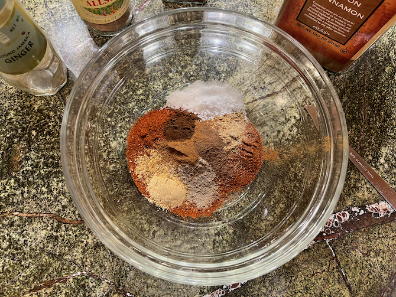
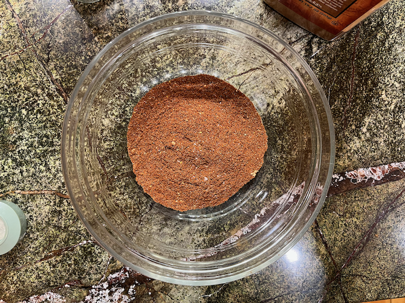

[photographed]: ../indices/photographed.html

# Ethiopian Berbere

This is based on TwoSleevers' [Ethiopian Berbere Mix](https://twosleevers.com/ethiopian-berbere-mix/#ethiopian-berbere-mix), a spice mix used for [beef](../meat/ipEthBeefStew.md), chicken, and [lentils](https://www.daringgourmet.com/misir-wat-ethiopian-spiced-red-lentils/#recipe), but I cut it down in both quantity and cayenne.

## Ingredients

* 2 1/2 T smoked paprika
* 1 tsp. ground ginger
* 1/2 tsp. cayenne pepper (or to taste)
* 1/2 tsp. ground coriander
* 1/2 tsp. ground fenugreek
* 1/2 tsp. ground cardamom
* 1/2 tsp. ground cinnamon
* 1/4 tsp. ground allspice
* 1/4 tsp. ground clove
* 1/2 T kosher salt

## Directions

Mix.

