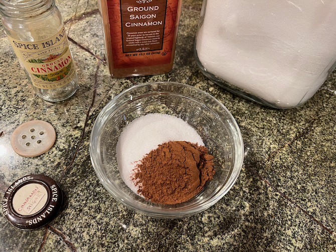

[photographed]: ../indices/photographed.html

# Cinnamon Sugar

Samantha got into the cinnamon sugar, so I needed to look it up yet again.  So this is one of those recipes to save me a short trip around the Internet every so often.

The traditional Internet recipe is 1/4 cup sugar plus 1 tablespoon cinnamon, but that's only about half of a small spice jar, so I scaled it up a bit.  To do your own cinnamon sugar math, the ratio is 1 part cinnamon to 4 parts granulated sugar.

Makes 1 jar.

## Ingredients

### Spice Jar

* 1 T + 1 tsp. cinnamon
* 1/3 c. sugar

### Mason Jar

* 1/4 c. cinnamon
* 1 c. sugar

## Directions

Mix.

## Variants

You may need more cinnamon for baking use; if you do, or if you just want to cut back on the sugar anyway, 
you can mix up your cinnamon sugar at a 1:3 ratio instead.
