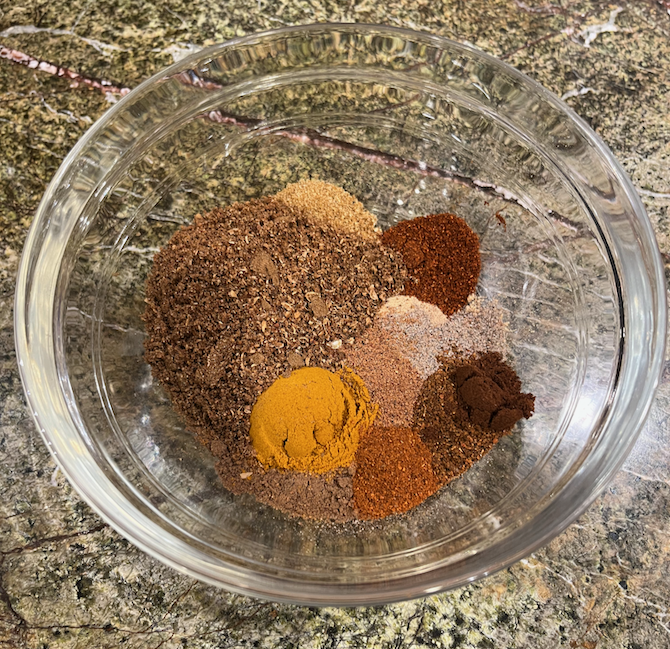

[spiceMixes]: ../indices/spiceMix.html
[photographed]: ../indices/photographed.html

# Moroccan Spice Mix (Ras el Hanout)

This is good for putting on frozen vegetables, [roasted chickpeas](../appetizers/chickpeas.md), or [whiting](https://www.thespruceeats.com/whiting-moroccan-fried-fish-recipe-2394646) (1 tsp. per pound).
I've revised it to include more spices, but not too much cinnamon, a la [MarocMama](https://marocmama.com/how-to-make-ras-el-hanout/).

Makes 1 jar.

## Ingredients

* 2 tsp. ground ginger
* 2 tsp. ground cumin
* 2 tsp. ground mace (optional)
* 2 tsp. ground cardamom
* 1 tsp. ground coriander
* 1 tsp. ground allspice
* 1 tsp. ground nutmeg
* 1 tsp. turmeric
* 1/2 tsp. black pepper
* 1/2 tsp. white pepper (optional)
* 1/2 tsp. pure chili powder
* 1/2 tsp. sweet paprika
* 1/2 tsp. ground cinnamon
* 1/4 tsp. cayenne pepper
* 1/4 tsp. ground cloves
* 1/4 tsp. ground fenugreek (optional)
* 1/8 tsp. ground bay leaf (optional)
* 1/4 tsp. nigella (before grinding)
* 1/4 tsp. anise seed (before grinding)
* 1/4 tsp. fennel seed (before grinding)
* 5--10 threads saffron (for grinding)
* 2--3 star anise pods (for grinding)

## Directions

1. Optionally, toast whole ingredients (except saffron) for up to 10 minutes at 325° (or in a skillet) and let cool.
   
2. Measure other ingredients.
   
3. Grind whole spices.
   
4. Mix.
   
5. Store in a spice jar.

## Variants

Some ingredients are optional because I don't keep them around.  
Rose petals, lavender, and orris root are other optional ingredients I also don't have around, and seemed rare enough not to bother listing.

Feel free to move spices (in their whole versions) to the grinding portion of the recipe.  Quantities are flexible enough to just eyeball them.
