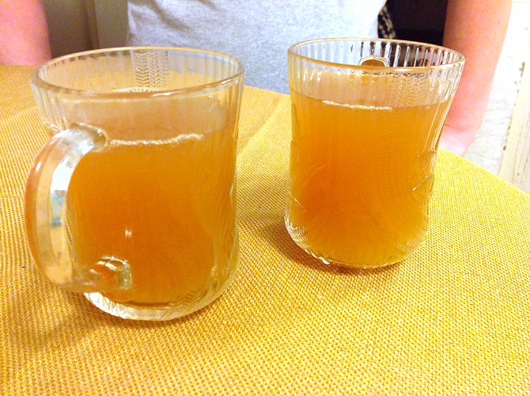
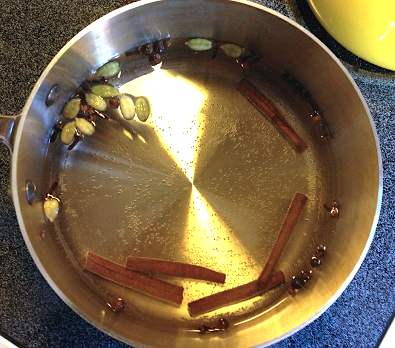

# Hot Toddy

This is Peter's recipe for hot toddies. Measurements are approximate and may be revised later.

## Ingredients

* 1 quart water
* 5 cinnamon sticks
* 11 cardamom pods
* 15 whole cloves
* 12 whole allspice
* 1/2 T. sliced fresh ginger
* 1 lemon, sliced
* 1 lime, sliced
* 2 T. honey
* whiskey (optional)

## Directions

1. Simmer dry spices 15 minutes.
2. Add ginger and fruit.
3. Simmer 15 more minutes.
4. Squish fruit through strainer and discard rind.
5. Strain out spices and discard.
6. Add honey and whiskey (1/2 shot per 6 oz).
7. Serve hot.

Note: the timings are by no means precise, but avoid cooking the citrus too long or the result will be bitter.
