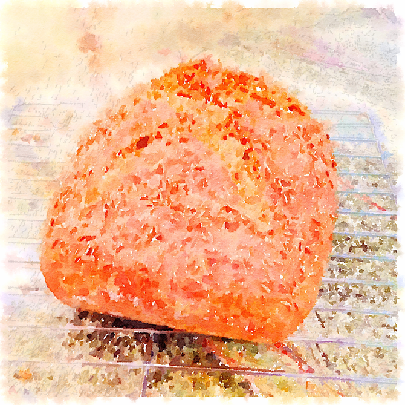
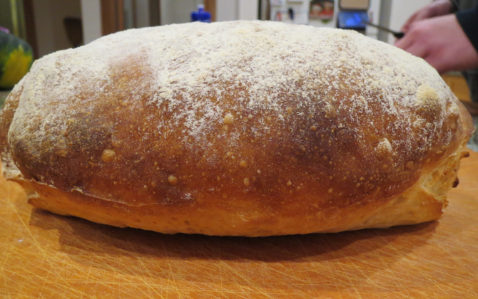

# Bread Advice

I've made many breads and bread-like things, but my favorite is no-knead bread.  Why knead when you don't have to?  My no-knead source is [Artisan Bread in 5 Minutes a Day](http://www.artisanbreadinfive.com/).  You can find the basic recipe online in the book's blog: [Master](http://www.artisanbreadinfive.com/2013/10/22/the-new-artisan-bread-in-five-minutes-a-day-is-launched-back-to-basics-updated) [Recipe](http://www.artisanbreadinfive.com/2008/04/27/great-coverage-in-the-week-magazine-but-there-was-one-little-problem), and elsewhere. 

Most of the variants I make from the book involve substituting a cup of something else for a cup of white flour in the basic recipe:  a cup of rye flour (and some caraway seed) for rye bread; half a cup of rye flour and half a cup of whole wheat flour for "peasant" bread.  Some involve shape, like slathering a lump of the basic dough into a flat rectangle on parchment paper, letting it rise while the oven is preheating to 450°, dusting it with flour, baking for 20 minutes, and presto, ciabatta!

Other fast shapes include naan and baguettes (more details below), and za'atar bread, a nice flatbread with za'atar (spice mix) and olive oil. 

The master recipe from the "healthy" sequel to _Artisan Bread in 5_ is a nice, heavy bread.  You can find it here or online.  I found some more recipes from the sequel (which I don't have) online at [King Arthur Flour](http://www.kingarthurflour.com/blog/2010/02/14/when-trends-collide-no-knead-meet-whole-grain/).

This chapter also includes some non-bread things you may need for your bread.

