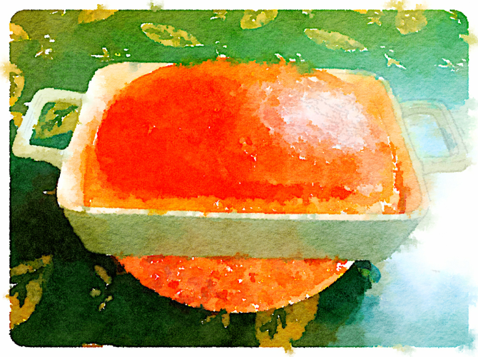

# Artisan Bread Index

The original version of Artisan Bread in Five Minutes a Day didn't have a useful index of which breads could be made from which doughs, and I couldn't find one online either, so I compiled my own. The page numbers are in parentheses. The variants must be mixed up separately. I've left out the non-bread recipes for now, since I usually ignore them.  (I don't know what changed in the revised version; I haven't seen it in person.)  

Some notable recipes from their blog have been added as well.

## BOULE (26) 

baguette (32), batard (36), ciabatta (37), couronne (39), crusty white sandwich loaf (43), olive bread (51), caramelized onion and herb dinner rolls (108), sun-dried tomato and parmesan bread (112), pizzas (135, 137, 138), spinach and cheese calzone (142), Philadelphia Stromboli with sausage (144), pissaladière (148), focaccia with onion and rosemary (150), olive fougasse (152), fougasse stuffed with roasted red pepper (154), za'atar flatbread (161), pita (163), lavash (168), naan (173), sticky pecan caramel rolls (187), [pumpkin seed rolls](https://artisanbreadinfive.com/2013/11/22/the-refrigerator-rise-trick-on-crazy-busy-thanksgiving-morning-fresh-rolls-kurbiskernbrot-from-the-german-alps/)

Variants: herb bread (31), pain d'epi (41)

## EUROPEAN PEASANT BREAD (46)

olive bread (51), caramelized onion and herb dinner rolls (108), sun-dried tomato and parmesan bread (112), pizzas (135, 137, 138), spinach and cheese calzone (142), Philadelphia Stromboli with sausage (144), pissaladière (148), focaccia with onion and rosemary (150), olive fougasse (152), fougasse stuffed with roasted red pepper (154), za'atar flatbread (161), pita (163), lavash (168), naan (173)

Variants: bran-enriched white bread (72), English granary-style bread (91), oat flour bread (104), Aunt Melissa's granola bread (114)

## Rye

DELI-STYLE RYE (58): caraway swirl rye (61), onion rye (63)

PUMPERNICKEL (67): onion rye (63), pumpernickel date and walnut bread (70)

Variants: limpa (65), Eastern European potato rye bread (120), flatbrød (176)

## LIGHT WHITE WHOLE WHEAT (74)

olive bread (51), sun-dried tomato and parmesan bread (112), pizzas (135, 137, 138), spinach and cheese calzone (142), Philadelphia Stromboli with sausage (144), pissaladière (148), focaccia with onion and rosemary (150), olive fougasse (152), fougasse stuffed with roasted red pepper (154), za'atar flatbread (161), pita (163), lavash (168), naan (173)

Variants: 100% whole wheat sandwich bread (76), whole wheat sandwich bread inspired by Chris Kimball (78)

## Other Grains

ITALIAN SEMOLINA (80): olive bread (51), sun-dried tomato and parmesan bread (112), pizzas (135, 137, 138), spinach and cheese calzone (142), Philadelphia Stromboli with sausage (144), pissaladière (148), focaccia with onion and rosemary (150), olive fougasse (152), fougasse stuffed with roasted red pepper (154), za'atar flatbread (161), pita (163), lavash (168), naan (173)

BROA (82): yeasted Thanksgiving corn bread with cranberries (86), spicy pork buns (88)

OATMEAL BREAD (94): raisin-walnut oatmeal bread (98), apricot-walnut oatmeal bread (99)    
OATMEAL PUMPKIN BREAD (100): oatmeal pumpkin seed bread (102)

VERMONT CHEDDAR BREAD (106): caramelized onion and herb dinner rolls (108)    
Variants: spinach feta bread (110)

ROASTED GARLIC POTATO BREAD (118)    
Variants: Eastern European potato rye bread (120)

## Bagels and pretzels

BAGELS (122): bialys (125), soft pretzels (127)    
Variants: Montreal bagels (129)

## OLIVE OIL (134)

olive bread (51), sun-dried tomato and parmesan bread (112), pizzas (135, 137, 138), spinach and cheese calzone (142), Philadelphia Stromboli with sausage (144), prosciutto and olive oil flatbread (146), pissaladière (148), focaccia with onion and rosemary (150), olive fougasse (152), fougasse stuffed with roasted red pepper (154), za'atar flatbread (161), lavash (168)

Variants: tapenade bread (55), sweet Provençal flatbread with anise seeds (157), pine nut-studded polenta flatbread (159), Moroccan anise and barley flatbread (170)

## CHALLAH (180)

turban-shaped challah (183), onion pletzl (185), sticky pecan caramel rolls (187), beignets (197), chocolate- or jam-filled beignets (199), Swiss muesli breakfast bread (215), chocolate prune bread (219), [Easter bunny brioche rolls](https://artisanbreadinfive.com/2018/03/24/easter-bunny-brioche-rolls/), [blueberry morning buns](https://artisanbreadinfive.com/2016/07/19/fresh-fruit-brioche-muffins/)

## BRIOCHE (189)

turban-shaped challah (183), onion pletzl (185), sticky pecan caramel rolls (187), brioche à tête (191), almond brioche "Bostock" (193), brioche filled with chocolate ganache (195), beignets (197), chocolate- or jam-filled beignets (199), Swiss muesli breakfast bread (215), chocolate prune bread (219), apple and pear coffee cake (223), sunny-side-up apricot pastry (225), blueberry lemon curd ring (228), braided raspberry almond cream pastry (231), cinnamon twists and turns (233), [cinnamon twists](https://artisanbreadinfive.com/2017/02/27/cinnamon-twists/), [cinnamon rolls](https://artisanbreadinfive.com/2011/03/28/2897/), [blueberry morning buns](https://artisanbreadinfive.com/2016/07/19/fresh-fruit-brioche-muffins/), [Nutella swirl bread](https://artisanbreadinfive.com/2016/05/19/nutella-swirl-bread/), [soft Thanksgiving pull-apart buns](https://artisanbreadinfive.com/2010/11/25/soft-thanksgiving-pull-apart-buns/)

Variants: panettone (201), sunflower seed breakfast loaf (217)

CHOCOLATE BREAD (211): chocolate prune bread (219), [chocolate nutella swirl buns](https://artisanbreadinfive.com/2019/03/11/chocolate-nutella-swirl-buns/)    
Variants: chocolate raisin babka (221)

## Enriched breads

soft American-style white bread (204)

BUTTERMILK BREAD (207): cinnamon raisin bread (209)

---

## Toppings and insides

Cornstarch wash (51), tapenade (55), granola (116), kumquat champagne confit (236)
