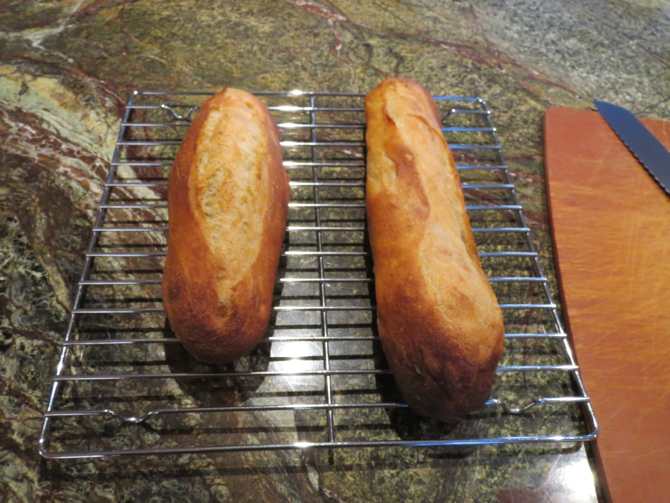
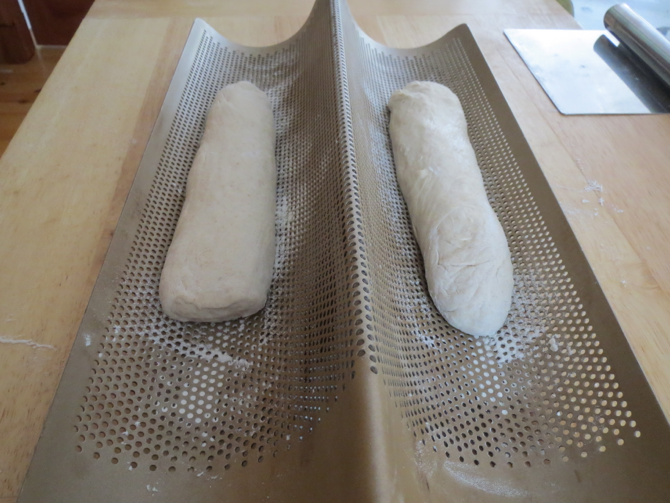
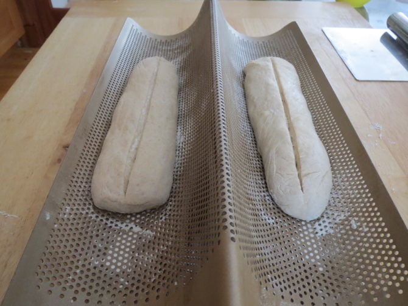
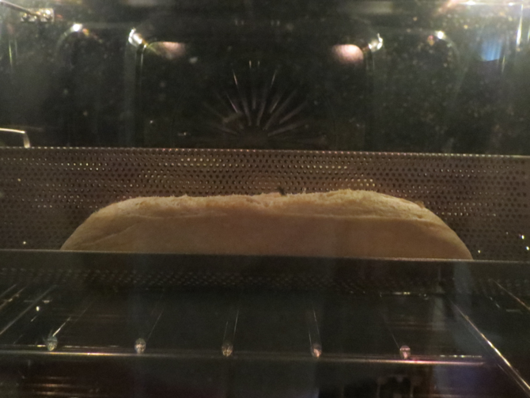
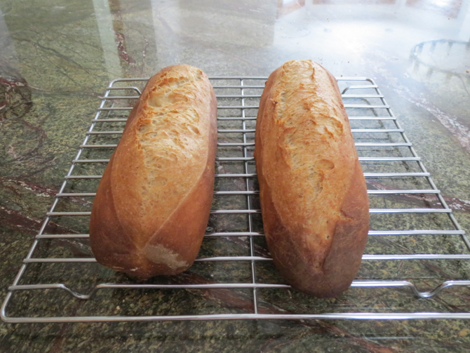
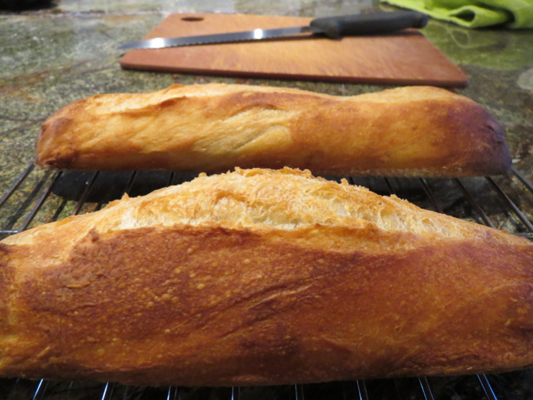

[noKnead]: ../indices/noKnead.html
[photographed]: ../indices/photographed.html

# Baguette

These baguettes are a combination of the baguettes in the _Artisan Bread in 5_ book and the instructions on the back of [my birthday baguette pan](http://www.williams-sonoma.com/products/8175283/).  Beware of the nasty glue on that one; you might want to buy an [alternative baguette pan](http://www.chicagometallicbakeware.com/non-stick-perforated-baguette-pan.html).

Oiling the non-stick baguette pan seems to be unnecessary.

## Ingredient

* 1 lb refrigerated [Master Recipe](../bread/master.md) dough

### Equipment

* baguette pan
* broiler pan

## Directions

1. Using plenty of flour, roll dough out into 1 or 2 cylinders, 2 inches in diameter.
2. Dust the baguette pan with flour and place the proto-baguettes in there.  
3. Let baguettes rest for 20 minutes while preheating the oven to 450°, with a broiler pan for steam on a lower rack.
4. Brush baguette(s) with water and, optionally, slash them crosswise.  
5. Place baguette pan in oven and pour 1 c hot water into the broiler pan.  
6. Bake 25 minutes, turning the oven down to 425° if the baguettes get too brown.
7. Cool on a rack.  

It's hard to slash baguettes when they're in the baguette pan (try lengthwise instead), or if the dough is very moist.  Fortunately, Peter likes the aliens-exploded-out-of-this-loaf look.

## Variants

The book doesn't mention any other doughs that work as baguettes, but I was able to make them with the Light Whole Wheat dough (the one with 5 1/2 c. white and 1 c. whole wheat).

I assume that the Peasant Bread dough (substitute 1/2 c. rye for 1/2 c. of the whole wheat) would also work, but I haven't tried it yet.

I have added vital wheat gluten to a fresh batch of dough on occasion to try to keep the baguette from sticking in the holes of the baguette pan.  Bread-flourification of regular flour is a dark art, but I just toss in about a tablespoon for four loaves, and remove the corresponding volume (not weight) of flour.  As it turned out, the only effective cure for sticking is baguette-sized slices of parchment paper, preferably removed halfway through the baking time.
