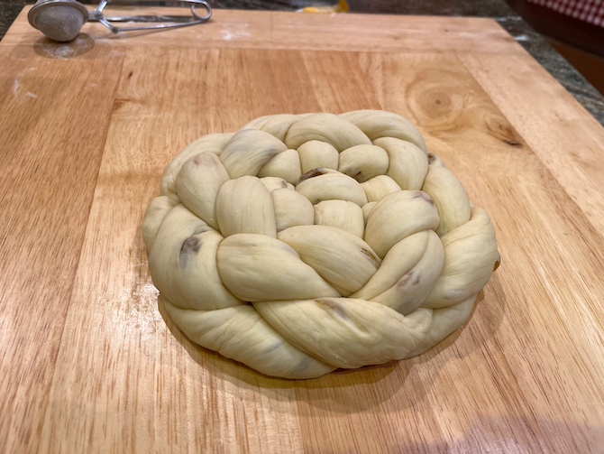
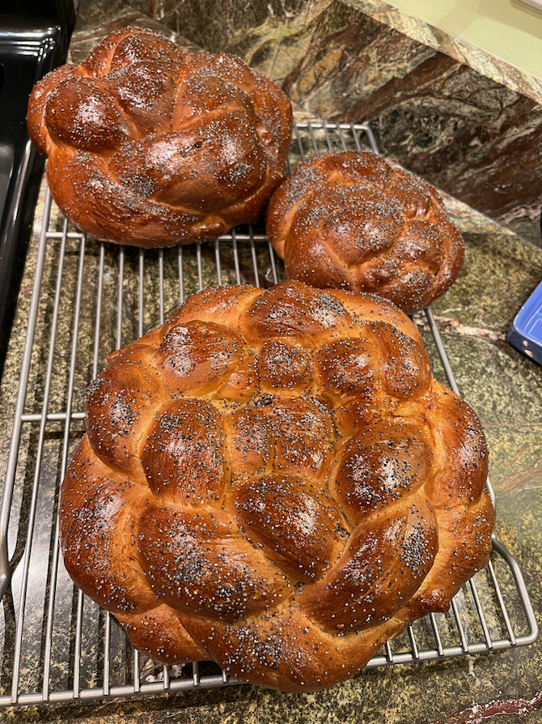

[KitchenAid]: ../indices/kitchenAid.html
[photographed]: ../indices/photographed.html

# Yes-Knead Challah

I've made the challah no-knead recipe, and I've also made the challah recipe in *The Book of Jewish Food* by Claudia Roden.  I usually cut them both down to 2 loaves for convenience.  In the latter I also altered the flour (for reasons that were not penciled in) and found an actual poppy measurement, as follows.

Makes 2 braided or round loaves.

## Ingredients

* 1 T. yeast
* 1 1/8 c. bread-temperature water
* 1/4 c. sugar or honey
* 2 eggs
* 1/2 T. salt
* 1/4 c. oil
* 4 c. (4 5/8 c.) flour
* 3/8 c. (50 g.) raisins (optional, see instructions)

### Toppings

* 1/2 egg
* 1/2 T. poppy or sesame seeds (optional)

## Directions

1. Mix everything but the flour, raisins, and toppings well.
2. Add flour gradually, or all at once with a stand mixer and dough hook.
3. Knead 15 minutes or until smooth.  (You may need extra flour if you chose the honey option.)
4. Put in an oiled bowl and flip to coat with oil.
5. Cover with plastic wrap and let double in size (2--3 hours).
6. Punch down.
7. Optionally spread and knead in raisins, or just knead.
7. Divide dough in two.
7. To shape each loaf, roll out that portion of dough into ropes (about 1 1/4" in diameter):  three ropes for a braided loaf or one for a round loaf.
8. Braid from the middle, flip, and braid the rest.  (For a round loaf, coil around the thicker end.)
7. Let the shaped loaves rise another hour on an oiled cookie sheet or on parchment paper.
8. Brush with the half egg and sprinkle with optional seeds.
9. Bake at 350° for 30-40 minutes.

## Variants

For Rosh Hashana, include the optional raisins and make the loaves round.  You can braid a round loaf by starting with four or six strands woven together and then braiding the ends a bit and tucking them under.  There are several options in [this video](https://www.youtube.com/watch?v=R4HnpjdpUSg), while [this one](https://www.youtube.com/watch?v=_wZPqXPpPtA) goes into detail for a triaxial weave (star of David).

