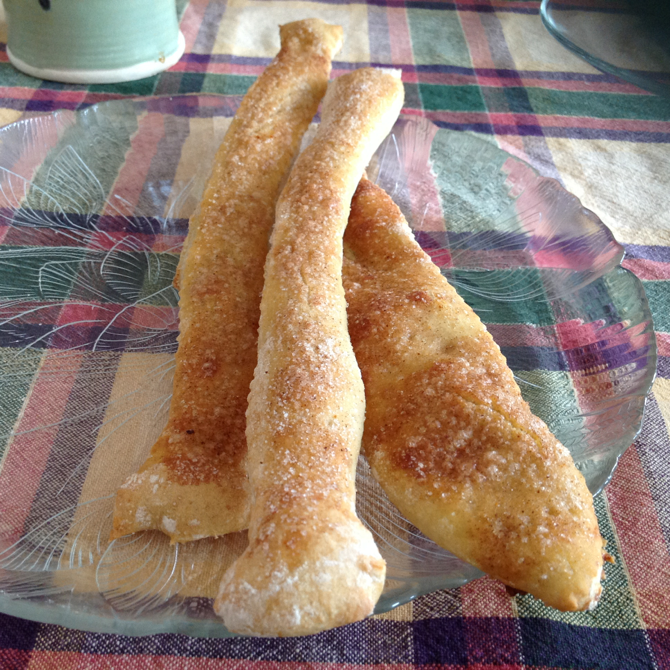

# Spicy Cinnamon Flatbread

I had some cinnamon sugar left over from making palmiers, so I went looking for a cinnamon flatbread to make with my refrigerator dough.  I took the spice idea from [this spelt flatbread recipe](http://www.food.com/recipe/cinnamon-flat-bread-156504) and the baking instructions from [this Martha recipe](http://www.marthastewart.com/349900/sweet-cinnamon-flatbread) (except that the oven temperature seemed to be in Celsius for unknown reasons).

They came out looking a bit more like breadsticks than flatbread:

## Ingredients

* 1 lb refrigerated [Master Recipe](../bread/master.md) or [olive oil](../bread/oliveOil.md) dough
* 2 T. sugar
* 1/2 tsp. cinnamon
* 1/8 tsp. cayenne pepper
* olive oil

## Directions

1. Preheat oven to 450°, optionally with a bread stone and/or a broiler pan for steam on a lower rack.
2. Roll dough out to 1/8" thickness.
3. Slice into 1" strips with a pizza cutter or pastry wheel.
4. Brush with olive oil and poke with a fork.
5. Sprinkle with sugar and spice mixture.
6. Optionally, pour a cup of water into the broiler pan.
7. Bake 10--15 minutes.

## Variants

I used an insulated cookie sheet instead of the stone.

