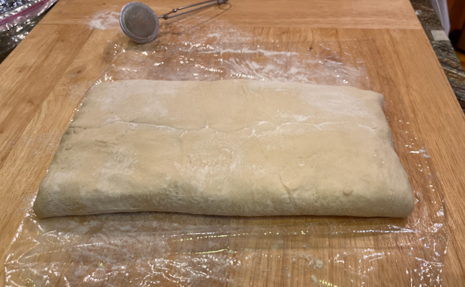
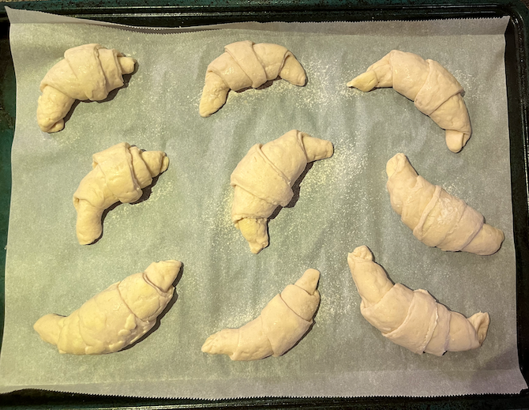

[photographed]: ../indices/photographed.html
[KitchenAid]: ../indices/kitchenAid.html

# Croissants

Croissant dough is a lot like [puff](../pie/roughPuff.md) [pastry](../pie/blitzPuff.md) dough, but it also includes yeast and milk.  Also like puff pastry, there are shortcuts you can take to make it less labor-intensive.  I've cut [the usual recipe](https://sallysbakingaddiction.com/homemade-croissants/) down to two sticks of butter.

Note that the dough stays cold; there is no rising step until after the croissants have been shaped.

Makes 10--12 croissants.

## Ingredients 

### Dough

* 2 2/3 c. all-purpose flour
* 2 T. plus 2 tsp. butter, softened
* 2 1/4 tsp. yeast
* 2 T. sugar
* 1/2 T. salt
* 1 c. whole milk, cold

### Butter Layer

* 2 sticks (1 c.) butter, softened
* 4 tsp. flour (optional)

### Egg Wash

* 1 egg
* 2 T. whole milk or cream

## Directions

1. Mix all dough ingredients except milk in a stand mixer.
2. Add milk slowly.
3. Knead for five minutes with a dough hook until slightly springy.
4. Flatten a bit and chill 1/2 hour.
5. Roll the dough out into a 10" x 10" rectangle.
6. Traditionally, you would chill it at least 4 hours at this point.
7. With a stand mixer and paddle attachment, cream the butter and flour for the butter layer.
   
8. Traditionally, you would spread it into a 5" x 10" rectangle on a silpat for chilling for half an hour, then peel it back off to place it across the center of the dough.  Non-traditionally, smooth the butter out into a 5" x 10" rectangle directly onto the middle of the dough.
   
   
9. Fold the dough over the butter.  (The two edges should meet in the center over the butter.)  If the butter wasn't chilled already, you can chill the whole thing a bit now, or not.
   
10. Roll out the folded dough and fold into thirds about three times, chilling a bit in between steps if the dough gets too warm or soft.
11. Chill again until ready to shape, at least four hours or overnight.
12. To shape, roll out on a lightly floured board into a 10" x 10" square or a 5" x 20" rectangle, then cut that into about 12 5" long triangles.
13. Gently stretch triangles in both directions.  Notch the base (short) end of the triangle and roll up from there.  
14. Curl slightly and place on a cookie sheet lined with parchment paper, with the point trapped underneath the croissant.
   
15. Let rise for one hour.
   
16. Optionally, chill for another hour.
   
17. Preheat oven to 400°F.
18. Mix egg wash and brush croissants.
   
19. Bake 20 minutes until golden, rotating halfway through.  Reduce heat if they get too brown.
   
   
20. Cool briefly on a rack.
   

## Variants

You can steal butter for the dough from the butter layer.

Many recipes scald the milk and/or proof the yeast; this isn't necessary with modern ingredients.

You can freeze the dough before shaping, or the shaped croissants after rising.  Defrost in the refrigerator before resuming where you left off.

For mini croissants, cut the dough into about 18 triangles, chill the formed croissants only half an hour, and bake them about 15 minutes, reducing the temperature partway through.

[Emma Fontanella](https://www.emmafontanella.com/the-easiest-croissants) has an interesting dosi-style approach to making croissants without all the folding and chilling.  In brief, after rising you divide the dough into 12 parts and the butter mix into 11 parts, roll the dough into circles, butter 11 sides and stack them up alternately.  Flatten the stack a bit and freeze for half an hour (or chill as desired).  Then roll out into a 15" circle, divide pizza-style into 12 triangles, and proceed as usual.
