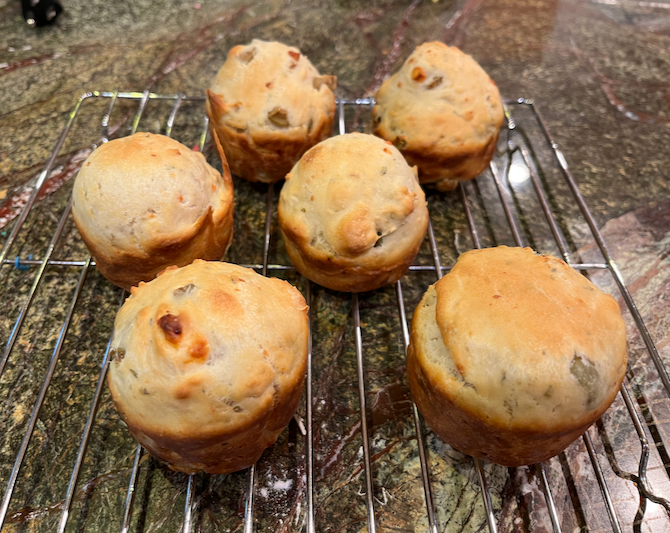
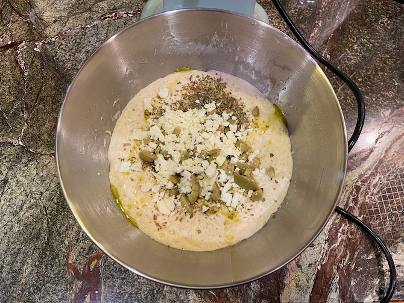
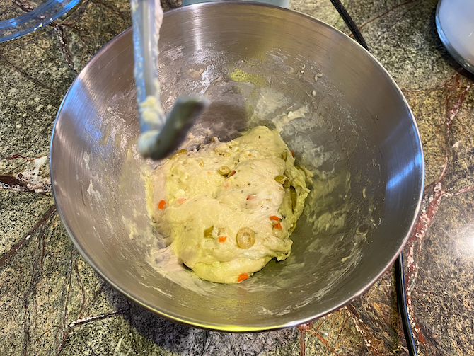

[noKnead]: ../indices/noKnead.html
[KitchenAid]: ../indices/kitchenAid.html
[photographed]: ../indices/photographed.html

# Eliopsomo Rolls

This is a dairy yeast roll recipe that was influenced by a couple of recipes at [Marilena's](https://marilenaskitchen.com/easy-greek-olive-bread/) [kitchen](https://marilenaskitchen.com/greek-feta-cheese-bread/).  She called for a cast-iron pan that I don't have.  I considered pouring the dough onto my pizza stone, but I'm always looking for new uses for my popover pan so I tried that instead. 

Since I got the KitchenAid, I don't batch up as much no-knead bread; this is an individual no-knead recipe.

Makes 6 muffins.

## Ingredients

* 3/4 c. milk
* 1 rounded tsp. yeast
* 3/4 tsp. salt 
* 1 1/2 c. flour
* up to 1/4 c. olive oil
* 1/2 c. chopped olives and/or feta
* 1/2 T dried oregano

## Directions

1. Warm the milk to 110° or so, in the microwave or a double boiler.
2. Oil a popover pan or six-cup muffin tin.
3. In a stand mixer or manually, mix the milk and yeast.  (A paddle is fine for this recipe.)  Pause for any yeast superstitions you may hold.
4. Mix the flour and salt together, then add to the milk mixture.
5. Cover and let rise 1 hour.
6. Preheat the oven to 375°.  Also preheat the pan.
7. Fold in remaining ingredients.  (This is a good moment for a dough hook.)
   
   
8. Divide into six parts to fill the hot pan.
9. Bake 20 minutes until golden on top.

Serve warm.

## Variants

For a similar recipe using non-dairy dough, see my [Tiropsomo](../bread/tiropsomo.md) or [Olive and Garlic Focaccia](../bread/oliveFocaccia.md).

For a similar recipe without yeast, see my [Alevropita](../quick-bread/alevropita.md).  Or make this, like that, in a preheated pie tin.

For enough to last longer than 30 seconds, double the recipe and make in a 12-muffin tin.
