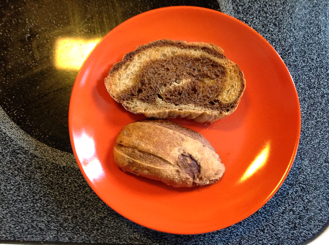
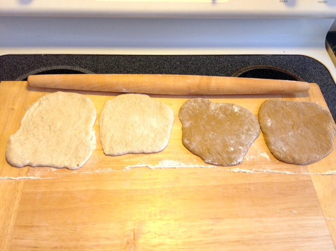
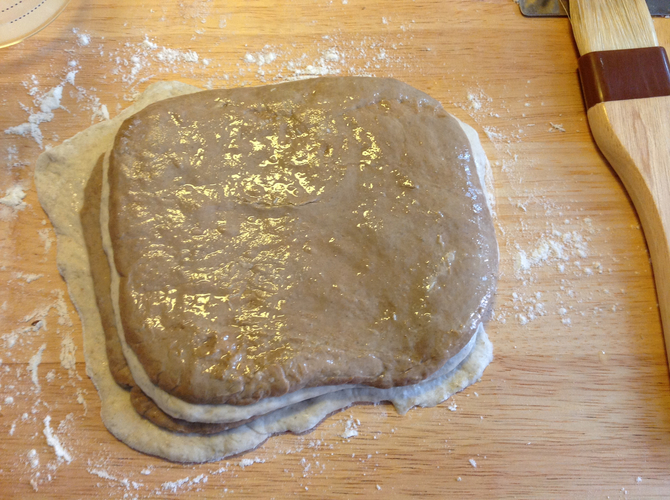
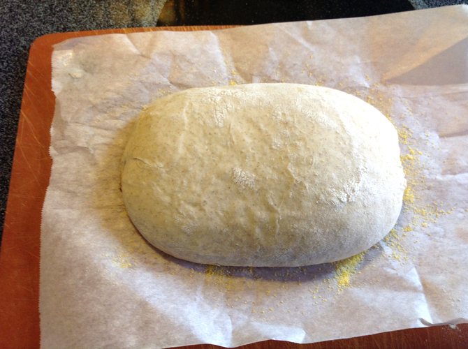
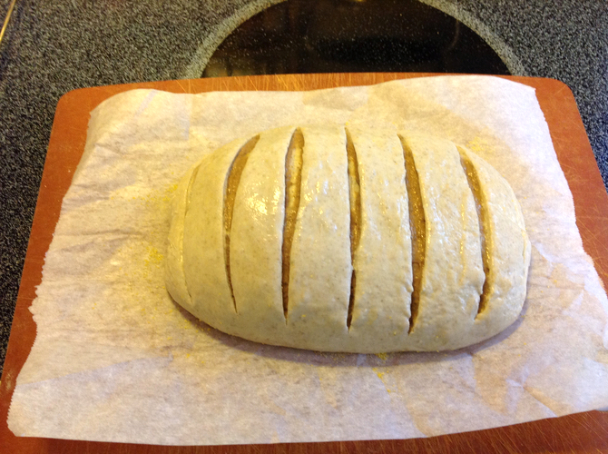
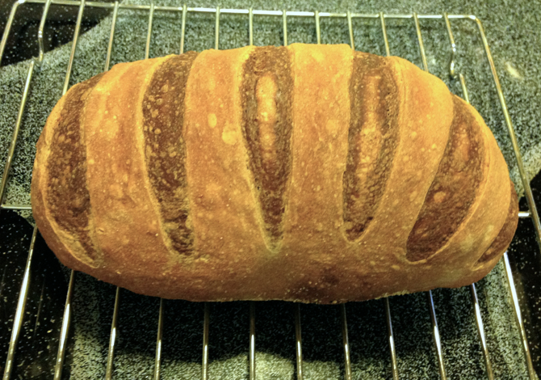

# Marbled Rye

I made marbled rye made from two different batches of 5-minute rye bread. I had one loaf worth of pumpernickel dough left, so I decided to make a batch of deli rye and marble them. This was complicated by the wetness of the dough and the different oven temperatures specified in the two recipes. I omitted the caraway from the deli rye dough because I thought it would be weird marbled. I omitted them from the outside of one loaf to tell it apart from an all-deli loaf I made the same day. I found [some marbling advice](http://www.abreadaday.com/?p=1365) online.

## Ingredients

* 1/2 lb pumpernickel dough
* 1/2 lb deli rye dough (without caraway seed)
* flour for dusting
* water for brushing
* cornstarch wash
* caraway seeds for sprinkling (optional)

## Directions

Make two batches of five-minute bread: pumpernickel (p. 67 in Artisan Bread in Five Minutes a Day) and deli rye (p. 58). You only need half a loaf from each (about 1/2 lb or 1/2 grapefruit). I'd recommend refrigerating the pumpernickel overnight, if not both of them. 

Cut each half-loaf in half again. Roll out on a pastry board using plenty of flour. 

Starting with a deli-rye piece at the bottom, wet its top with a pastry brush and stack them up, alternating colors and wetting each top, including the last pumpernickel. 

Roll up. Roll the roll, connecting its ends. Keeping the ends on the bottom, shape the loaf into an oval. Place on a piece of parchment paper. Let rise for an hour. 

Preheat the oven (with the bread stone and steam pan) for 20 minutes at 425°. Brush the loaf with cornstarch wash (p. 51). Optionally, sprinkle with caraway seeds. Slash the loaf crosswise (see picture).

Place in oven and add 1 c. hot water to the steam pan.  Bake 40 minutes, removing the parchment paper halfway through. Cool on a wire rack. 

Since your remaining dough is now missing half a loaf, you may want to do this all again.

