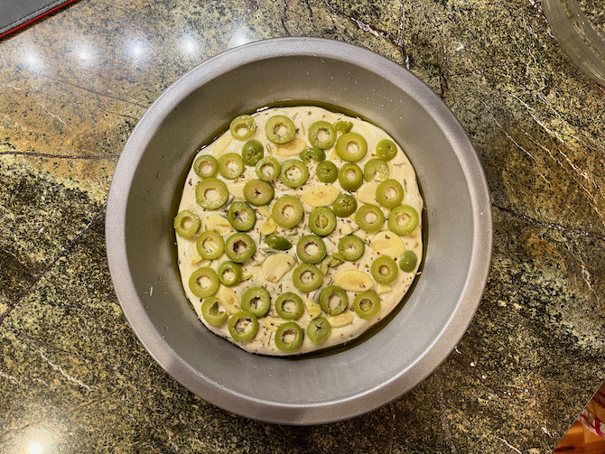

# Olive and Garlic Focaccia

This is a yeast flatbread from the *Artisan Bread in 5* [blog](https://artisanbreadinfive.com/2009/06/22/olive-garlic-and-fresh-herb-focaccia-on-the-grill/), adjusted to not go on the grill, but to still use a pie plate.  It differs from the one in the book (p. 150) in lacking onions and the considerations that baking onions brings (most notably lower temps and onion pre-cooking time).  

## Ingredients

* 1 orange-sized chunk of (preferably) olive oil no-knead dough (1/2 lb.)
* 2 T olive oil
* 1/4 c. chopped olives
* 2 cloves garlic, chopped
* 1/2 tsp. rosemary (more if fresh)
* oregano to taste
* coarse salt to taste
* grated parmesan (optional)

## Directions

1. Oil a pie plate.
2. Sprinkle dough with flour and shape into a ball.
3. Flatten to 1/2" thick and place in pie plate.
4. Top with remaining ingredients.  
5. Preheat the oven to 450°, along with a broiler tray for water.
6. Let rise 20 minutes.
7. Make depressions in the dough with your fingers, to the extent possible.  Drizzle with more oil.
8. Put the bread in the oven and pour a cup of hot water into the broiler tray.
9. Bake 15--20 minutes or until medium brown.
10. Serve warm.

## Variants

If you get frustrated with the olives and garlic falling off, you can skip them and just do herbs and spices (which will also fall off). 

See this [Italian recipe book](https://www.italianrecipebook.com/focaccia-toppings/), [Marcellina](https://www.marcellinaincucina.com/focaccia-toppings/), or [various](https://recipes.net/articles/focaccia-toppings/) [other](https://insanelygoodrecipes.com/focaccia-toppings/) [lists](https://www.baked-theblog.com/easy-focaccia-bread-recipe-plus-40-topping-ideas/) for many more toppings.

Nigella is also an option, though not a traditional one.
