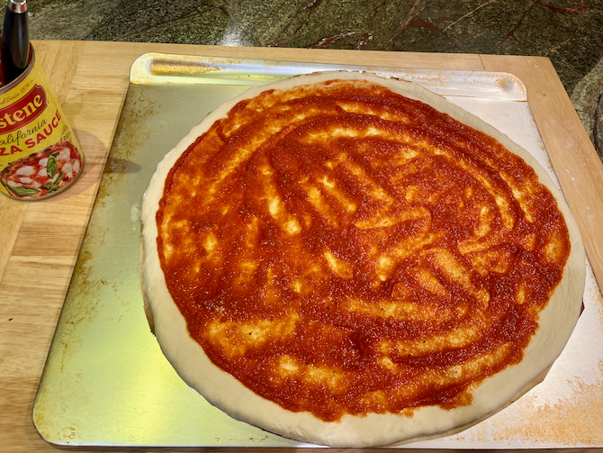
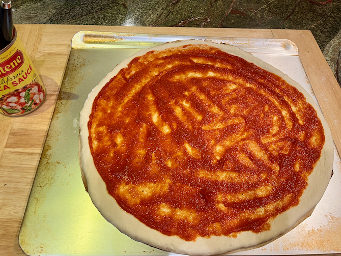
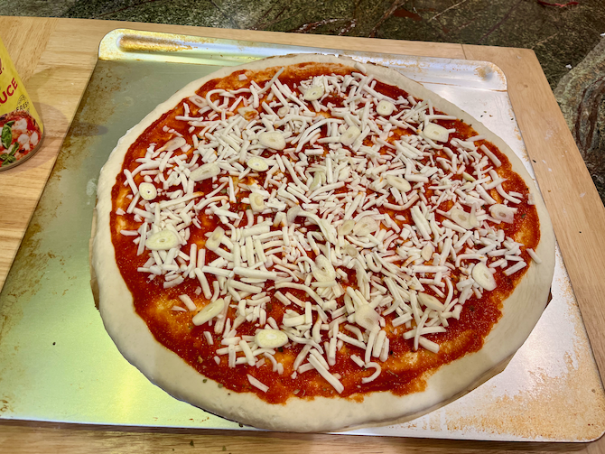
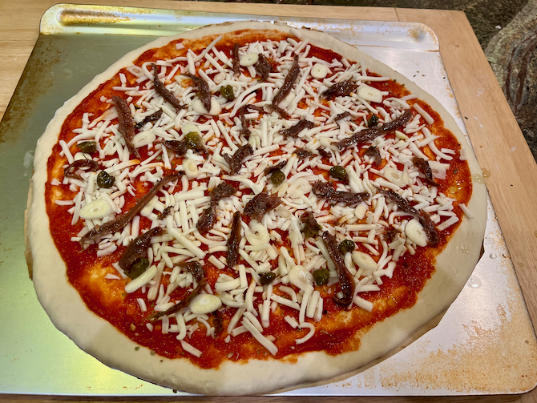
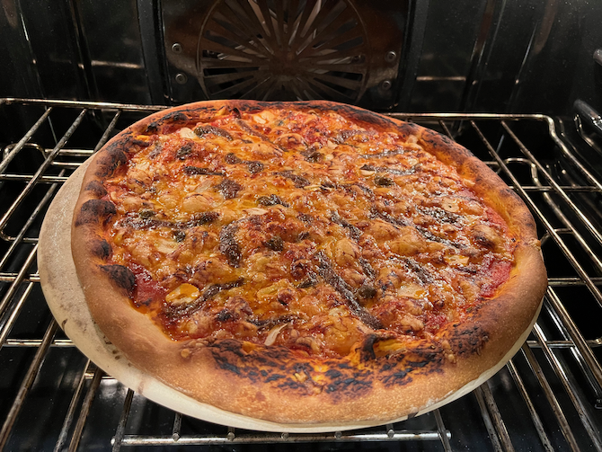

[noKnead]: ../indices/noKnead.html
[photographed]: ../indices/photographed.html

# Pizza Stone Pizza

If you have a 14" pizza stone, you can make _Artisan Bread in 5_ pizza from various refrigerator doughs.  (See my dough index for the full list.)  The ingredients are much like my [pan pizza recipe](../bread/panPizza.md), but it cooks faster and crispier, and no rising time is needed.

## Ingredients

* 1--1 1/4 lbs refrigerated [olive oil](../bread/oliveOil.md) or [Master Recipe](../bread/master.md) no-knead dough
* 1/4 lb shredded mozzarella
* 1 T. parmesan (optional)
* pizza or pasta sauce
* oregano
* basil
* sliced garlic or garlic powder
* 1 can anchovies (optional)
* sliced olives (optional)

## Directions

1. Preheat the oven and stone to 550°.
2. Using minimal but adequate flour, roll dough out on parchment paper into approximately the shape of the pizza stone.
3. Transfer dough to a peel or flat cookie sheet.
3. Spread sauce on pizza, not too thickly.  
4. Season to taste.  
5. Distribute cheese.  
6. Distribute remaining toppings.  
7. Transfer dough carefully to stone.
7. Bake 10--15 minutes.  Use a knife to poke holes in any bubbles you may spot.
8. Check pizza for doneness at 8 minutes and remove the parchment paper at that point.  
9. Let cool 5 minutes before slicing.

## Variants

You're supposed to use a floured peel, but that's just too difficult compared to the parchment paper method.

Instead of anchovies, crumble and sprinkle 4 oz. of raw ground Impossible Burger onto the pizza before cooking.

You can use [pesto](https://web.archive.org/web/20180118035738/https://www.crazyforcrust.com/caramelized-onion-pesto-flatbread-pizza/) instead of red/pizza sauce; in that case reduce the temperature to 450° or so.

For white pizza, omit the pizza sauce and add 4 oz. ricotta, plus optionally up to 4 oz. grated parmesan or other hard cheese.

If you don't have pizza sauce and object to putting pasta sauce on pizza, it's easy to [make your own]().
