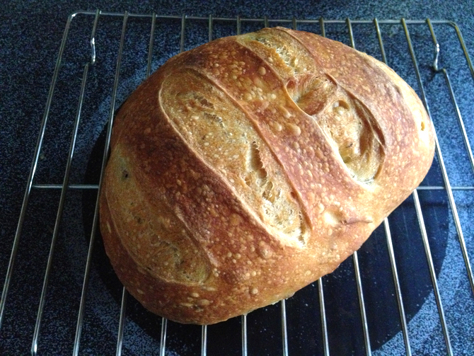

# Rosemary Boule with Kalamata Olives

This is just the standard 5-minute bread recipe (see link below) using both the herb and olive bread variants. I only rolled olives into my last loaf (out of the batch of four), since I was too busy for that step with the other three. The herb variant called for 1/2 teaspoon dried rosemary or 1 tsp fresh. I had extra fresh rosemary (which I chopped a bit) so I cut back on the dried thyme (from 1 tsp dried or 2 tsp fresh). 

To add olives, roll the dough out, spread 1/4 cup halved olives around, and roll it back up. Use cornstarch wash instead of flour to decorate the loaf. To keep the olives from popping out of the crust, I left a big oliveless space in the rolled-out dough and folded that over the top of the rolled-up section. This did not keep them from popping out of individual slices.
