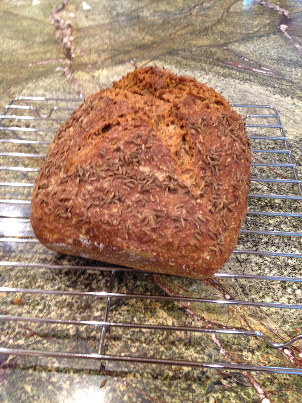

[photographed]: ../indices/photographed.html

# Healthy Rye

I wasn't looking for healthy rye *per se* but for rye-y rye.  I found a [lighter rye variant](http://www.artisanbreadinfive.com/2010/03/29/my-favorite-rye-isnt-in-our-books-heres-how-to-slash-it-careful-its-sticky) of the _Artisan Bread in 5_ rye recipe online, which used only half a cup of dark rye flour in order to simulate medium rye, but Peter was not particularly impressed.

So I experimented and came up with a heavier, non-sourdough rye.  I don't know if it's good for you; the point was just to get a "healthy" quantity of rye into no-knead dough using vital wheat gluten.  The experiment is ongoing.  

One important scientific discovery was that my square Ikea glass baking dish is the perfect size for a free-form loaf that doesn't actually want to keep its form.  See the directions for more details.

## Ingredients (2 loaves)

* 2 c water
* 1 T molasses
* 3/4 T yeast
* 3/4 T kosher salt
* 3/4 T caraway seed
* 2 1/2 c white flour
* 1 1/2 c whole rye flour
* 2 T vital wheat gluten, sifted or mixed into the white flour

## Directions

### Free-Form

Follow the Healthy Bread directions, but note that the dough is very sticky and airy so won't actually form a gluten cloak, will stick to whatever you cover it with, and may spread if you fall asleep while it's rising.  Fortunately, you can just fold it in half again and pop it in the oven if it's gotten too wide.

### Loaf Pan

Mix the ingredients in the order listed and let rise 2 hours as usual.  Refrigerate until needed.  To bake:

1. Line the bottom of the pan with parchment paper.
2. Dust dough with white flour, form into a ball, and put in pan.
2. Let rise about 90 minutes, preferably covered with something that won't touch it; it's sticky.
3. Preheat oven to 375° with the usual steam pan but no bread stone.
4. Insert loaf and 1 c. hot water.
5. Bake for 30 minutes.
6. Remove from oven, remove from pan, remove parchment paper.  Caution: hot!
7. Increase heat to 425° and bake the loaf on your oven rack another 10 minutes.

Times approximate.

