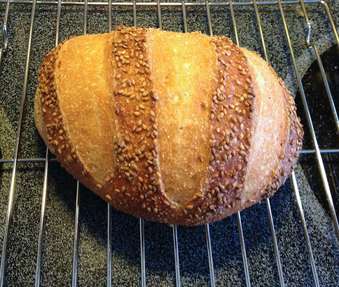

[noKnead]: ../indices/noKnead.html
[photographed]: ../indices/photographed.html

# Semi-semolina Bread

The semolina recipe in Artisan Bread in 5 Minutes a Day warned against using non-durum semolina, but that was all I had, so I substituted 1 1/2 cups white flour for half the semolina in the recipe.
