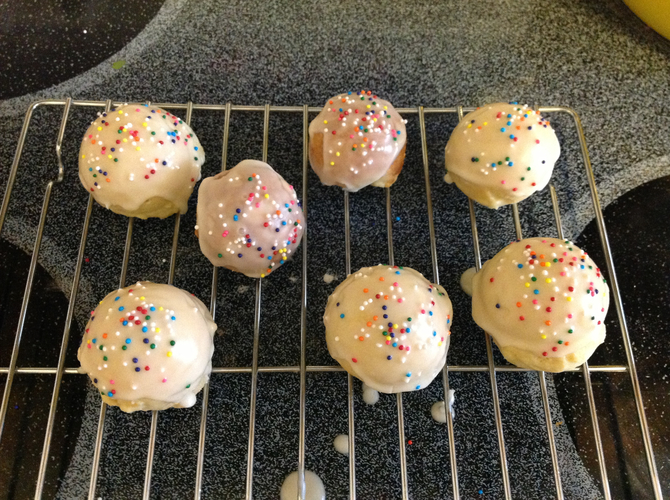

# Anise Cookies

I cut this down from another recipe, [Auntie Mella’s Italian Cookies](http://theapronarchives.com/2012/04/05/auntie-mellas-italian-soft-anise-cookies/), because I only had two eggs. I also made it non-dairy and switched to anise oil.  Note that you can use a cake ball pan for these--the only use I've found yet for my cake-ball pan.

## Ingredients

Cookies:
* 2 eggs
* 2 2/3 tsp. baking powder
* 1/4 tsp. anise oil
* 1/2 c. sugar
* 2 2/3 c. flour
* 1/2 c. pure olive oil
* 1/3 c. soy milk 

Icing:
* 1 1/3 c. powdered sugar
* 4 tsp.-2 T. soy milk
* 1/8 tsp. anise oil

## Directions

Mix eggs, sugar, and anise. Add oil and milk. Add flour and baking powder. Roll out walnut-sized and place on parchment-paper lined cookie sheets (or drop into cake ball pan). Bake 10-12 minutes at 350 degrees. Mix icing. Dip and sprinkle.
