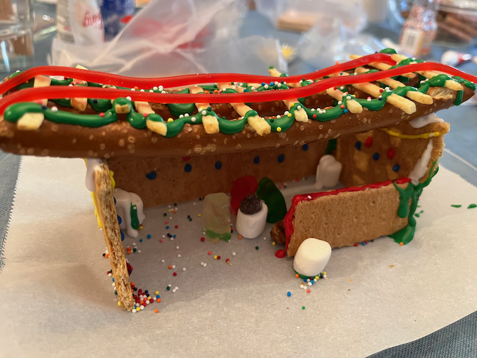
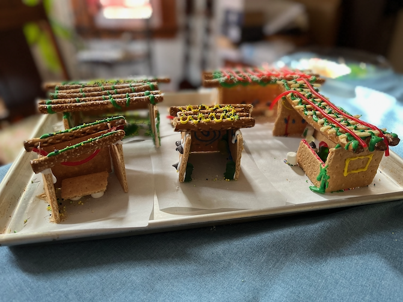

[KitchenAid]: ../indices/kitchenAid.html
[photographed]: ../indices/photographed.html

# Gingerbread House

There's a wide range of gingerbread recipes for house-building purposes, from primarily decorative to downright delicious, and the recipe is neither the first nor the last of the long list of decisions you must make when the free prefab gingerbread house work promised you and you promised your toddler falls through:

* Inedible or theoretically food or yummy?
* Prefab or prebaked or from scratch?
* [Cookie cutters from China](https://www.michaels.com/product/gingerbread-house-cookie-cutter-set-by-celebrate-it-10724090) or [paper templates](https://sallysbakingaddiction.com/wp-content/uploads/2018/12/Sallys-Baking-Recipes-Gingerbread-House-Template.pdf) or [3D printed cookie cutters](https://www.thingiverse.com/thing:5964496)?
* McMansion or medium (~5") or [miniature](https://www.amazon.com/Christmas-Stainless-Chocolate-Biscuit-Decorating/dp/B0779FF1R1?tag=mcdema-20)?
* Boxy or A-frame or Victorian?
* Butter or Crisco or margarine? 
* [Royal icing](../cookies/royalIcing.md) or [melted sugar](https://www.instagram.com/reel/C0rNjZbOVbz/) or a hot glue gun (blech)? 
* [Sugar glass](https://ladyoftheladle.com/dessert/easy-sugar-glass/) or [hard candy](https://www.allmomdoes.com/blog/3-ways-to-make-gingerbread-house-windows-no-candy-thermometer-required/) or [expensive isomalt](https://sugargeekshow.com/recipe/isomalt-recipe/) windows?

I wanted something on the more edible side, with molasses, shortening, and less than a whole bag of flour, so I started with [the best gingerbread recipe ever](https://tikkido.com/blog/BEST-gingerbread-house-recipe-free-printable-templates), then simplified and spiced it up a bit.  (The original recipe is [here](https://tikkido.com/sites/default/files/PDF-gingerbread-house-recipe.pdf); weights, though in ounces, are also available, as is an entire e-book about gingerbread.)  Another bonus for the toddler was that this dough doesn't require chilling, though it tolerates it, and the baked pieces don't require a day of rest to harden.

This makes some extra, so you can either cut out extra house fronts for decorating, use standard cookie cutters, or make some miniature houses.

Makes 2--3 medium houses.

## Ingredients

### Cream

* 2 c. white sugar
* 1 c. brown sugar
* 1 c. butter-flavored Crisco
* 3 eggs
* 1/4 c. molasses

### Dry

* 2 tsp. baking soda
* 1 T. ground ginger
* 1 T. cinnamon
* 1/2 T. allspice (optional)
* 1 tsp. ground clove
* 1/2 T. salt
* 5--6 c. flour

### Other

* crushed hard candy or prepared isomalt for windows
* 1 c. melted sugar for assembly and/or windows, or [royal icing](../cookies/royalIcing.md) for assembly
* royal icing and/or [crusting buttercream](https://sallysbakingaddiction.com/gingerbread-house/#tasty-recipes-66571) for decoration
* candy and other edible decorations

## Directions

### House

1. Preheat oven to 375°, or 350° with convection.
2. In a stand mixer with pastry cutter attachment **on low**, or by hand, cream granulated sugars and Crisco.
3. Cream in eggs, then molasses.
4. Mix other dry ingredients with a cup of the flour, and cream in. 
5. Mix in four more cups of flour.
6. If the dough is still sticky, add up to another cup of flour.
7. Divide the dough in half and roll out onto parchment paper to 1/8" thickness.  (Note that this is thinner than most gingerbread house recipes.)
8. For best results, cut shapes out in place, with about 1/2" spacing.  (Remove the spacing dough and optionally reroll to make any smaller parts.)  Don't forget to punch out any door and window holes at this point, and bake them separately or reroll.
9. Bake 10--13 minutes.  If filling windows with crushed candy, pause at 7 minutes to do so, then stop baking when the windows look flat.  You may also want to remove small pieces like chimneys or cutout doors early. 
10. Let cool on the sheet(s) or on a rack.
11. If making windows without crushed candy, leave windowed pieces face up on the parchment paper (or a silpat) and fill windows with the melted isomalt or sugar.  (See directions below.)  Cool again and carefully remove from parchment paper.
12. Assemble the house on a sturdy base using [royal icing](../cookies/royalIcing.md) or melted sugar.

When filling windows, be careful to use enough crushed candy to account for settling, or, if using melted sugar, be careful not to overfill the holes.

It's handy to have a base(ment) piece of gingerbread for the house, but any kind of base will do, including cake rounds, tin foil over cardboard, or parchment paper on a half-sized baking sheet.  When assembling with icing, you may need temporary supports such as empty cans.  Don't forget them inside the house, and be careful to point the flat sides inwards.

### Melted Sugar

When melting sugar or isomalt, use only heatproof (*i.e.*, non-plastic) utensils.  Don't transfer to cold glass or pyrex.  Keep children away and, if possible, wear gloves.

1. 
    a. Heat a cup of sugar in a clean, wide pan on the stovetop on medium, stirring frequently, until it turns amber.  (If you have a small pan for pouring and you can get a candy thermometer into it, the temperature you're aiming for is 300°F for glass, or 320°F for glue.)
	b. Or, re-melt prepared isomalt (chunks) according to package directions.
	c. Or, cook raw isomalt (granules) according to package directions.
	d. Or, microwave sugar and karo (corn) syrup at a 2:1 ratio in a Pyrex measuring cup, on high for 2.5--5 minutes until it turns amber, watching it like a hawk the whole time.
2. You can add food coloring or even candy flavors at this point.
3. Pour carefully into windows, or dip gingerbread edges into the pan for assembly.  If the pieces are too big for dipping, you can spread sugar onto edges using a metal knife.

The windows cool quickly enough that you can make both windows and glue this way, though you may not want to waste expensive isomalt gluing the gingerbread house together.  If your microwaved sugar hardens too much to use, you can nuke it again.

If you have extra, you can turn it into hard candy by pouring it onto a silpat or a well-greased cookie sheet, or into a silicone mold.

If you overshoot by any method, you can still use the burnt remains for glue.  Also, if you've burned all your karo syrup in a microwaving accident, you can try again with a cup of sugar and a quarter cup of water, or a similar sugar glass recipe.

## Variants

If you don't want to use parchment paper or a silpat, you can grease the cookie sheet.  If making windows, you should switch to parchment paper, a silpat, or aluminum foil at that point, though re-greasing the cookie sheet extremely well could, theoretically, work.

It's common to chill the dough quite a long time, and I suppose it couldn't hurt if it's feeling too soft.  Another trick is to freeze the pieces before baking to reduce spread.  It's somewhat less common to give the pieces a day to stale up a bit, but if that fits your schedule it's harmless.

It's easy to make your own royal icing with meringue powder, powdered egg whites, or the traditional way [with egg whites](../cookies/royalIcing.md).  The internet recommends homemade over kit icings or store bought, especially for assembly.

Some people use a microplane to square house parts before assembly.

You can use any old non-royal, non-crusting frosting for decorating as long as you don't mind a sticky house.  If the toddler's going to eat it momentarily you may as well use up whatever you have around.

A fine toddler tradition is to skip the gingerbread altogether and use graham crackers instead.  I might have tried this if I hadn't already done it for Sukkot:     
