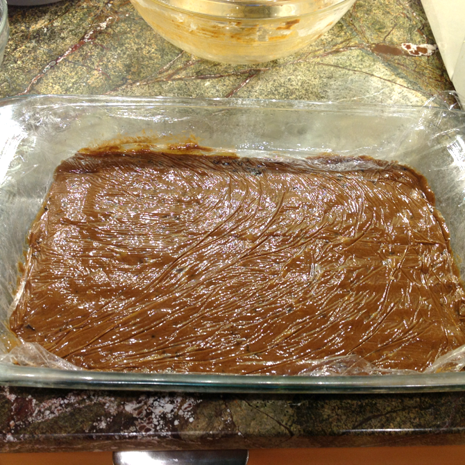

# Hermit Bars

Hermits were the first cookie, and are still a traditional New England cookie.  Mom got some in a nut-free, bar form somewhere and liked them, so I [read all about their history](http://www.newenglandrecipes.org/html/hermit-cookie.html) and then found a modern recipe [at Epicurious](http://www.epicurious.com/recipes/food/views/hermit-bars-12777) to adapt.

The first time I made them, I forgot the currants until the last minute and had to sprinkle them on top and pack them down, which worked out better than I expected.

Gooeyness varies somewhat unpredictably with baking time, thus the wide range of cooking time.  Mom apparently prefers them less gooey.

Makes 9x13 inches of bar cookies.

## Ingredients

### Dry

* 1 3/4 c. flour
* 1/2 tsp. baking soda
* 1/2 tsp. salt
* 1 tsp. Vietnamese cinnamon
* 1/2 tsp. nutmeg
* 1/4 tsp. clove
* 1/4 tsp. ginger

### Cream

* 1 stick (1/2 c.) butter
* 2/3 c. brown sugar, packed
* 1 egg
* 1/4 c. molasses

### Other

* 1 c. currants, dusted with flour if necessary to separate them
* sanding sugar (optional)

## Directions

1. Butter and flour a 9x13 baking pan.
1. Mix the dry ingredients.
1. Preheat oven to 350° (with convection).
2. Separately, cream the butter with the sugar, then beat in the egg and molasses.
3. Mix the dry ingredients into the creamed ingredients.  Do not overmix.
4. Mix in the currants.  Do not forget the currants.
5. Pack the resulting mass into the baking pan.  (Plastic wrap is helpful here, and/or a little roller.  Skilled professionals might get away with using the butter wrapper and their fingers.)
6. Optionally, top with sanding sugar.
6. Bake 20--30 minutes or until it tests clean.
7. Cool completely in pan on a rack.
8. Cut into bars.

## Variants

It is possible to make these as drop cookies, though I haven't tried it.

Replace about 1/4 c. of the currants with chopped candied fruit, for even more of that scary-old-dessert-food flavor.

It is possible to substitute baking powder for half or all of the baking soda, and I have tried it with no obvious ill effects.
