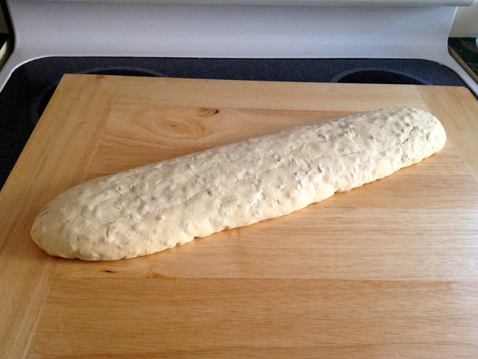
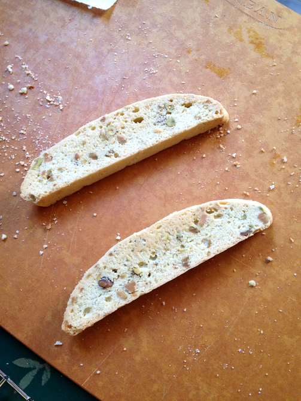

# Pistachio Biscotti

This recipe is for non-dairy pistachio biscotti. The yield depends on how you form and cut the logs. I've never gotten as few as the 18 the original recipe alleged. These are my friend Sarah's favorite of my rather small cookie repertoire.  Based on Recipe #44360 on the now-defunct Recipezaar, which included butter, lemon zest, and an almond option.

## Ingredients

* 3 c. all-purpose flour
* 1 1/2 tsp baking powder
* 1/4 tsp salt
* 3 large eggs
* 1 c. sugar
* 1/2 c. pure olive oil (or vegetable oil, but NOT extra virgin olive oil)
* 1 tsp vanilla extract
* 1/2 tsp almond extract
* a few drops lemon extract (optional)
* 1 c. chopped pistachios

## Directions

Heat oven to 325°. Combine flour and baking powder and set aside. Whisk together eggs, sugar, oil, extracts, and salt in a large bowl. Stir in flour combination. Stir in nuts. 

Form dough into one or two long narrow logs on parchment paper on an insulated cookie sheet. Bake 30 minutes or until toothpick comes out clean. Cool 15 minutes. 

Cut log(s) on an angle into 1/2 inch slices using a very sharp or serrated knife. 

Lay slices flat on an uninsulated cookie sheet and bake 10-12 minutes or until golden on each side. (The recipe inconveniently makes about 1 1/4 toasting batches.)

Cool on wire rack. 
