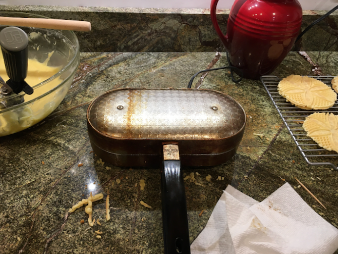
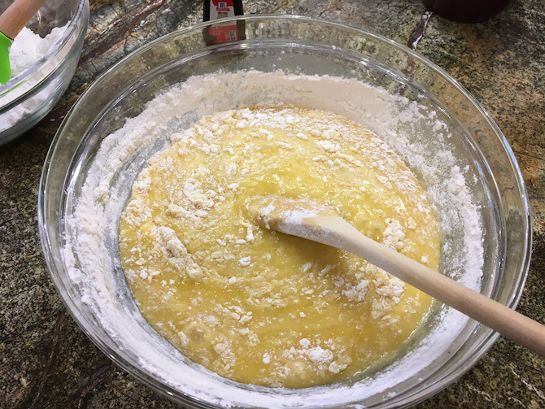
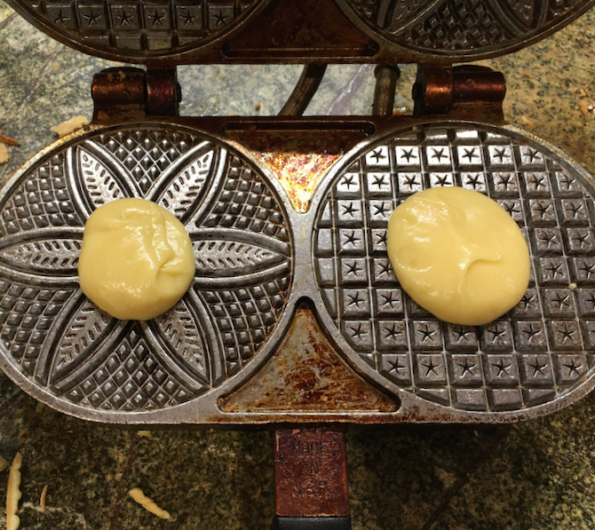
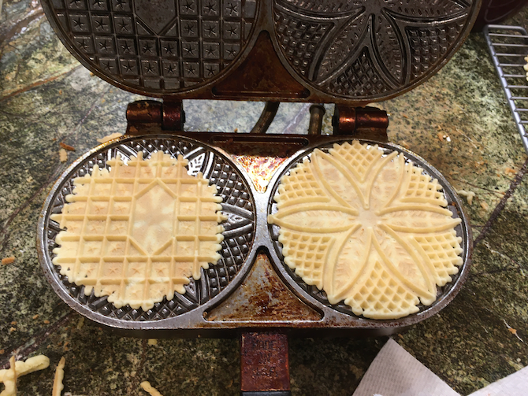

[photographed]: ../indices/photographed.html
[potluck]: ../indices/potluck.html

# Pizzelles

This is close to the recipe that came with my original iron (which has long since burned out), except for using oil in place of butter. I found the oil version on the Villaware web site back when they made pizzelle irons.  Note that pure olive oil is **not** extra virgin olive oil.  The flavor of EVOO is too strong for cookies.

My current iron is from Palmer:

Beware when shopping for "anise" that you get aniseed oil (or extract), not star anise oil.  LorAnn makes anise oil.  Also beware that two teaspoons is a **lot** of anise oil. You may want to cut back if serving non-Italians.

## Ingredients

* 6 eggs
* 1 1/2 c. sugar
* 1 c. pure olive oil
* 2 tsp. anise oil (or 2 T. anise extract)
* 3 1/2 c. flour
* 4 tsp. baking powder

## Directions

1. Plug in pizzelle iron. Grease and heat according to manufacturer's instructions.
2. Beat eggs. 
3. Beat in sugar. 
4. Add oil and anise. 
5. Mix baking powder in with the flour.  Gradually add it all to the dough. 
6. When the iron is ready, drop a scoop of dough per cookie in the center of the pattern. 
7. Close and bake 30 seconds each or until the steam mostly stops.
8. Open and remove cookies with a spatula.   

If dough squeezes out the sides of the iron, you've used too much.  Be sure to scrape it off (because it doesn't get cooked).  Too little dough will make seasonal snowflakey edges; it won't harm the cookie any.

If the cookies are too soft and/or tear when you try to remove them, cook them a little longer and/or let the iron heat up more.

If you experience sticking issues, unstick any crumbs with a toothpick and regrease.

## Variants

See [Pizzelles by the Egg](../cookies/pizzellesByTheEgg.md) for variants.

I don't think the manufacturer recommended it, but I grease the pizzelle iron with (very little of) a stick of Crisco.  If you're using butter instead of oil, that's another convenient greasing stick.
