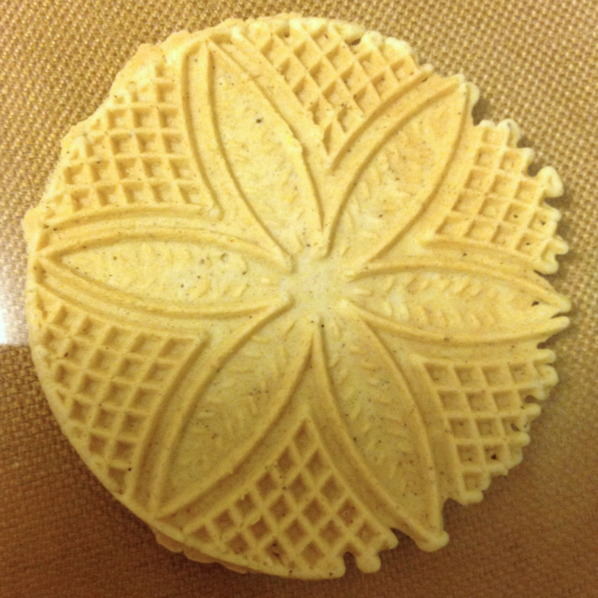

# Pizzelles by the Egg

This version of the recipe is for cookie math as well as variants like chocolate pizzelles, eggnog pizzelles, etc.  (I sometimes go up to 8 eggs or experiment with a couple, so I broke down the pizzelle recipe to a single egg.)

Peter is responsible for the eggnog variant.

## Ingredients

* 1 egg
* 1/4 c. sugar
* 1/6 c. pure olive oil (2 T. + 2 tsp)
* 1 tsp. extract (or 1/4 tsp. flavor oil)
* scant 2/3 c. flour
* 2/3 tsp. baking powder

## Directions

See full pizzelle recipe for directions.

## Variants

For real pizzelles use anise extract or oil. 

For chocolate pizzelles use vanilla extract and add 1 T. cocoa and 1 T. sugar.

For almond pizzelles use 1 tsp. almond extract.

For eggnog pizzelles use half the vanilla extract and add 1/4 tsp. nutmeg and 1/3 tsp. ground clove .

For cinnamon pizzelles use 1 tsp. vanilla extract and 1 tsp. cinnamon.

For other flavors use extract or oil.

For gluten-free pizzelles, use buckwheat flour.

To color pizzelles, use a few drops of food coloring.  The baked color will be lighter than the dough color.

For two-toned pizzelles, use half a scoop each of two different colors (or chocolate and uncolored).  Put them side by side on the iron.  (The two-toned pizzelle idea came from a different chocolate pizzelle recipe at [King Arthur Flour](http://www.kingarthurflour.com/recipes/chocolate-pizzelle-recipe), which was too liquidy for my iron.)
