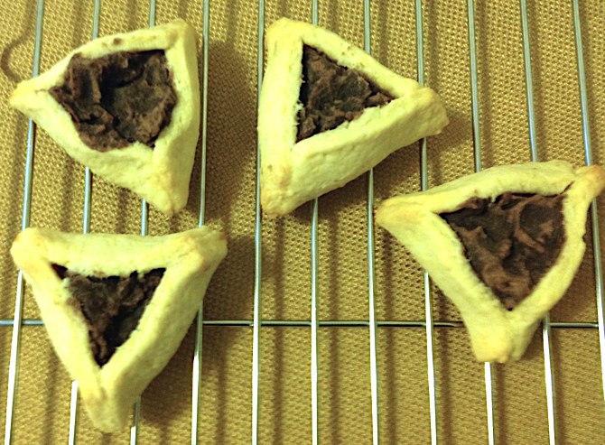

[photographed]: ../indices/photographed.html

# Red Bean Paste Hamantaschen

Peter had made red bean paste hamantaschen once before. I'm not a big fan of hamantaschen, but I am of red bean paste, so I tried it out. 
We also made a couple of refrigerator surprise hamantaschen; those are best left undocumented.  
Other fillings we've put into this cookie dough include cherry pie filling and lingonberry jam.

I wasn't happy with the King Arthur Cookie Companion dough recipe, so I based this one on [Tori Avery's](https://toriavey.com/toris-kitchen/dairy-free-hamantaschen/) instead (cut in half because I didn't actually need three dozen hamantaschen at the time).  I pinched instead of folded, and that made the edges a bit crispy compared to the main cookie.

## Ingredients

### Red Bean Paste Filling

* 1 14 oz. can Eden "aduki" beans
* 1 c. sugar
* water to cover

### Cookie Dough

* 1 1/8 c. flour
* 1/2 tsp. baking powder
* 1 egg
* 1/3 c. sugar
* 1/8 c. oil
* dash lemon or orange extract
* 1/2 tsp. vanilla
* 1/8 tsp. salt
* 2 tsp. water (as needed)

## Directions

### Filling

1. Drain and rinse beans.
2. Add to a small pot and cover with water.
3. Add sugar.
4. Bring to a boil.
5. Reduce to a simmer for up to an hour to desired consistency, optionally simultaneously with cookie prep.
6. Optionally, puree with an immersion blender.

### Dough

1. Mix the flour and baking powder.
2. Mix the remaining dough ingredients in a second bowl.
3. Gradually add dry bowl to wet bowl.
4. Preheat oven to 350°.
4. Grease a cookie sheet.
4. Knead dough just until smooth, adding water or flour if necessary.
5. Roll out to less than 1/8" thick.
6. Cut into 3" circles or hexagons.
7. Fill with a teaspoon of filling each.  Be careful not to overfill with something that will boil over, like jam.
8. Pinch or fold into the triangular shape.
9. Place on cookie sheet. (Spacing is not important.)
10. Bake 10--15 minutes until golden.
11. Cool on a rack.
12. Store in a sealed container.

## Variants

### Filling

I followed this [chunky recipe](http://web.archive.org/web/20120629051023/http://www.applepiepatispate.com/japanese/sweet-azuki-red-bean-paste/) (1 c. dried beans and 1 c. white sugar) for red bean paste the first time, but stuck my blender stick in it to smooth it out quite a bit.

Another option for red bean paste prep is the [Instant Pot](../vegetables/ipAdzuki.md).  You can make just the beans in it, or go all the way to paste.

Another plan for another year is Nutella hamantaschen, which I never seem to get around to making.

### Dough

Jamie Geller uses [extra-virgin olive oil](https://jamiegeller.com/recipes/olive-oil-hamantaschen/).  Cut down to this recipe's size, it's

* 1 1/4 c. flour
* 1 1/4 tsp. baking powder
* 1 egg
* 1/4 c. sugar
* 1/4 c. oil
* 1/4 tsp. lemon juice
* 1/2 tsp. lemon zest
* dash salt

The directions are the same.

I don't actually object to Crisco in my cookies (unlike Tori Avery), so I'll be on the lookout for yet another recipe.  I've also experimented with [yeast dough hamantaschen](../cookies/yeastHamantaschen.md).

I initially tried to follow the hamantaschen recipe from my King Arthur cookie cookbook (which looks the same as the one [on their website](https://www.kingarthurflour.com/recipes/hamantaschen-recipe)), but it came out too dry so I had to gradually add water like for pastry.

I cut these out with hexagon cookie cutters (about 3 1/4 inch across), folded them up in the middle of 3 sides of the hexagon, and glued them with egg yolk as the recipe recommended. The outcome was more like tiny red bean paste pies than regular hamantaschen, but we liked them that way.

