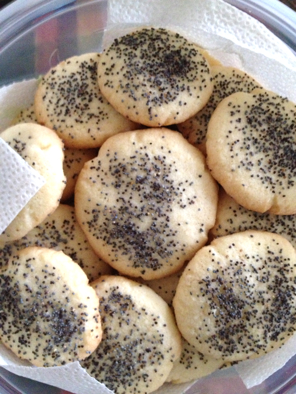

[passover]: ../indices/passover.html

# Nan Berenji

This is my classic rice flour cookie recipe that I've been making for years. It's from _Sephardic Cooking_ by Copeland Marks (p. 186).  I also experimented with a Nan Berenji recipe in the _New Food of Life_ cookbook, but that one failed.

Makes about 4 dozen.

## Ingredients

* 1 stick butter or margarine
* 2/3 c. sugar
* 2 eggs
* 1 T. water
* 2 c. rice flour
* 1/4 tsp. baking powder (optional)
* 1/4 tsp. ground cardamom
* 2 tsp. poppy seeds.

## Directions

1. Cream butter and sugar.
2. Mix in eggs and water.
3. Add dry ingredients (except poppy seed).
4. Optionally, refrigerate for 20 minutes to retard cookie spread.  (Also refrigerate between batches.)
5. Roll 1 heaping teaspoon at a time and press down onto greased or parchment-papered cookie sheet.
6. Sprinkle with poppy seed.
7. Bake 20 minutes at 350° (or 325° with convection).
