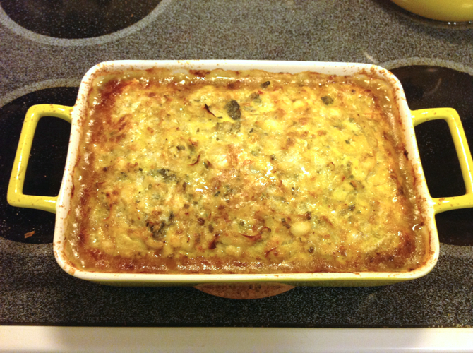
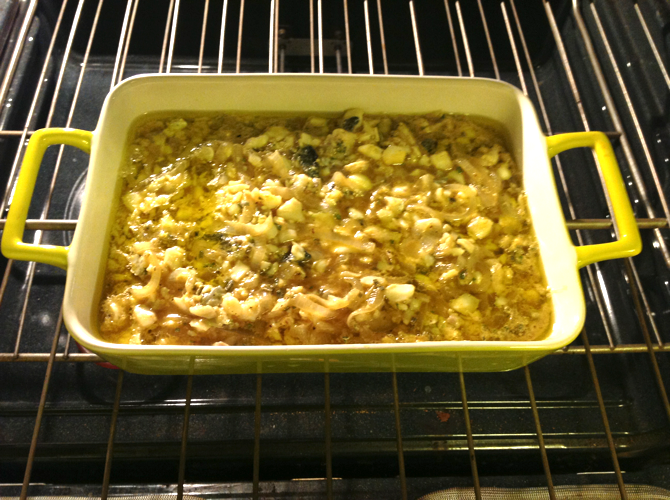

# Fish Kuku

Fish quiche. This is a variant recipe from the _New Food of Life_ cookbook (Meat Kuku, p. 102), also adjusted in size to fit the amount of fish I had. The original recipe called for the equivalent of 1 1/2 c. fresh parsley, 2/3 c. fresh chives, 2/3 c. of oil, and yogurt on the side, but since I didn't have it with me at the store I didn't grab those. (It's always parsley; I should have known.)

## Ingredients

* 1 1/2 lb whitefish fillets (haddock)
* 3 onions, sliced thin
* handful of freeze-dried parsley
* handful of freeze-dried chives
* 1 1/2 tsp. salt
* 1/3 tsp. black pepper
* 7 eggs
* 1/3 tsp. salt
* 1/3 tsp. cinnamon
* 1 1/2 tsp. curry powder
* olive oil for the pans

## Directions

1. Preheat oven to 350°F. 
2. Brown onions.
3. Chop and brown fish. 
4, Mix both with the next three ingredients (or just mix all the cold ingredients together).
5. Mix the eggs and remaining ingredients (except oil) in a separate bowl.
6. Pour some oil into the bottom of a 10 inch pan and heat in the oven briefly.
7. Mix fish and egg mixtures together and pour into the heated pan.  
8. Bake 30 minutes.
9. Add more oil to the top. Bake 20 more minutes or until brown.

## Variants

Use ground beef instead of fish.
