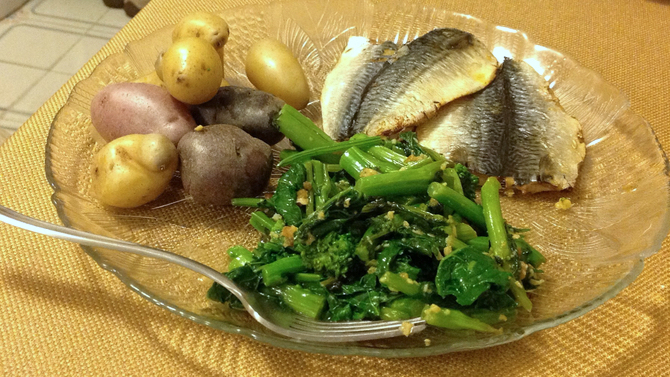

# Baked Mackerel

I made up this recipe when we got some frozen whole mackerel from Market Basket, but cleaning them was too much work for Peter.  Fortunately they sometimes have fresh cleaned mackerel as well, for which I consulted [a different whole mackerel recipe](http://www.themediterraneandish.com/oven-roasted-spanish-mackerel/) and added some more ingredients.

## Ingredients

* 1 3/4 lbs bag frozen whole mackerel (cleaned), or 1 1/2 lbs. pre-cleaned mackerel
* 1 tsp. salt
* 3 cloves garlic, crushed, or garlic powder to taste
* paprika
* powdered safflower (a Portuguese spice)
* thyme and/or mustard powder
* 1 tsp. ground coriander
* 1/2 tsp. cumin
* parsley
* dill
* 1 lemon, sliced thin (optional)

## Directions

1. Oil fillets and rub spice into flesh side.
2. Optionally, insert lemon slices.
3. Place in a baking dish, or on parchment paper on a baking sheet, skin side up.
4. Bake 10-12 minutes at 400°.

## Variants

The second recipe actually called for baking the mackerel in foil at 350° for 30 minutes, but that was much longer and foilier than I wanted.
