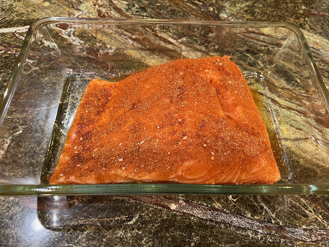
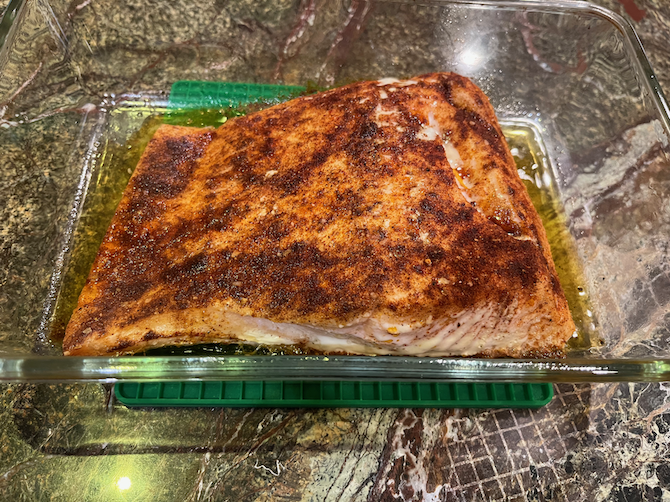

# Spicy Salmon

This is a variant of plain [Costco Salmon](../fish/costcoSalmon.md), optionally using Costco's big bags of single portions of frozen boneless, skinless salmon, based on Wellplated's [Spicy Baked Salmon](https://www.wellplated.com/spicy-baked-salmon/).  I don't use foil or broil.

## Ingredients

* 2--3 portions of frozen Costco salmon, defrosted
* olive oil
* 1 tsp. kosher salt
* 2 tsp. brown sugar
* 1/2 tsp. chili powder
* cayenne pepper to taste (optional)
* 1/2 tsp. smoked paprika (optional)
* 1 lime, zested
* 2 T. cilantro (optional)
* fresh chive or scallion to taste (optional)

## Directions

1. Preheat oven to 350° with convection.
2. Pour olive oil and squeeze lime into a small baking dish.
3. Rub the salmon in it.
4. Sprinkle with remaining ingredients.   
5. Bake 15 minutes or until just cooked through.

## Variants

Try it with fresh salmon.  The original recipe recommended wild caught Alaskan, skin on or off, used a whole teaspoon of chipotle chili powder for this much fish (which may work if you can find that exact chili powder), and did not include cayenne.

Other spice options include a generous coating of [Sri Lankan roasted curry powder](../appetizers/roastedCurryPowder.md), [Ajika](https://cleanplates.com/shopping/trader-joes-ajika-spice-blend/), [Berbere](../appetizers/berbere.md) (pictured above), [Ras el Hanout](https://www.epicurious.com/recipes/food/views/ras-el-hanout-101070), or za'atar.

[Kara Lydon recommends](https://karalydon.com/recipes/the-best-way-to-cook-salmon-slow-cooked-salmon/) baking salmon for 20--25 minutes at 300°.
