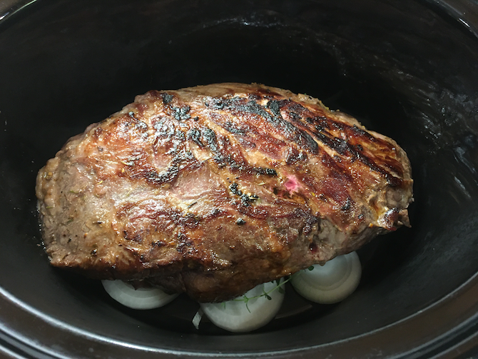
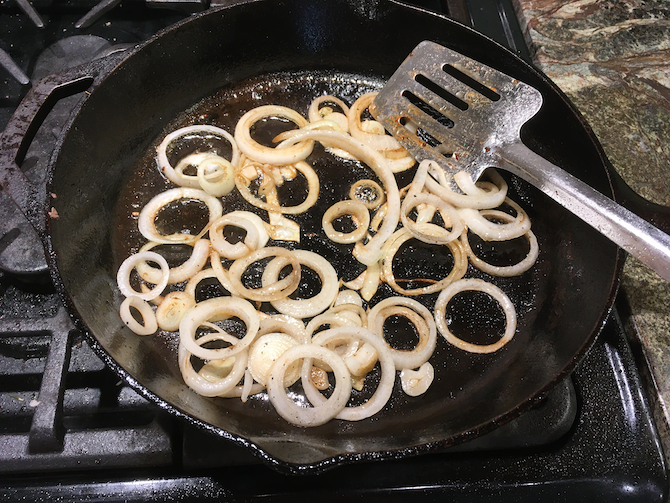
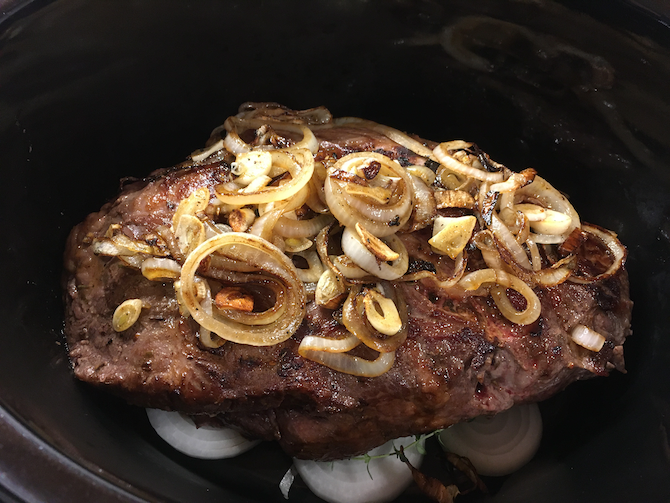

:[crockpot]: ../indices/crockpot.html

# Crockpot Briskette

Brisket recipes run large but (despite having come from Costco), my briskets remain small.  So here's a recipe for a 1 1/2 to 2 lb. brisket cut down from Tori Avery's [savory slow cooker brisket recipe](https://toriavey.com/toris-kitchen/savory-slow-cooker-brisket/) for a 4--6 lb. brisket, with some extra ingredients from my non-crockpot briskette recipe and from the Kitchn's [Slow Cooker Brisket and Onions recipe](https://www.thekitchn.com/recipe-slow-cooker-brisket-and-onions-recipes-from-the-kitchn-45437).

## Ingredients

### Rub

* 1 1/2 -- 2 lb. brisket
* 1 tsp. salt
* 1/2 tsp. pepper
* a generous dash mustard powder
* a generous dash thyme 
* 1 tsp. brown sugar (optional)
* 1 T. olive oil (for searing, not rubbing)

### Dry

* 4--5 cloves garlic, some whole, some sliced
* 1 or 2 red and/or yellow onions, sliced
* bay leaf

### Liquid

* 1/2 c. water, wine, or broth
* 1/2 tsp. paprika
* 1/4 tsp. turmeric
* 1/8 tsp. cayenne

## Directions

1. Divide the onions and put half into the bottom of the crockpot along with the whole garlic and the bay leaf.
1. Heat the oil in a heavy skillet.
2. Mix the rub spices and rub into the meat.
2. Brown the beef in the oil for 5 minutes per side, forming a brown crust.
3. Transfer the beef to the crockpot. 
4. Optionally, fry the remaining onions and garlic a bit. 
5. Top the beef with the fried onions and garlic. 
6. Deglaze the skillet over heat with the liquid ingredients.
7. Pour into crockpot.
6. Cook on low about 6 hours.
7. Optionally, let rest 20--30 minutes on warm or on a cutting board before serving.
8. Optionally, return sliced briskette to the crockpot sauce to warm back up.

## Variants

Tori makes the skillet stage optional, and in particular just blends in the onions at the end rather than caramelizing them first.

Cook longer for more sheddedness, shorter for more structural integrity.

Marinate the brisket before cooking.

Make it one or two days before serving and reheat up to an hour in the oven at 300°.

