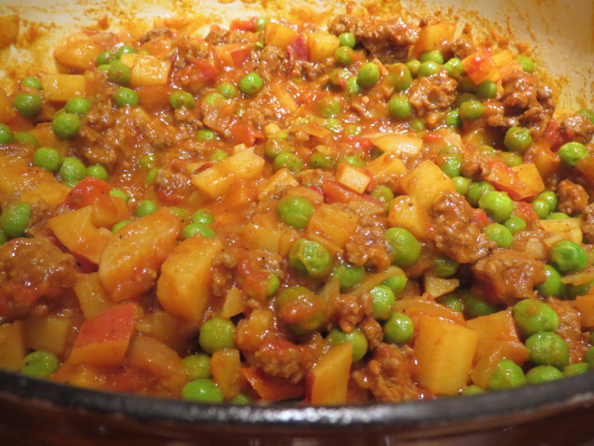

# Beef Curry

The notion of beef curry is just so *wrong* I was reluctant to make this, but I was bored with ground beef so I tried out [Pakistani Kima](http://wholenewmom.com/recipes/ground-hamburger-ground-recipes-recipes-for-indian/) and Peter liked it.  As usual there were alterations--one clove of garlic is never enough!  I made plain rice to go on the side.

## Ingredients

* 3 T. canola oil
* 1 onion, chopped
* 3 cloves garlic, minced
* 1 lb. ground beef
* 1 T. muchi curry powder
* 1/2 T. generic curry powder
* 2 1/4 tsp. kosher salt
* 1/8 tsp. black pepper
* 1/8 tsp. cinnamon
* 1/4 tsp. ground ginger
* 1/8 tsp. turmeric
* 2--4 arbol chiles, stemmed, or cayenne pepper to taste
* 1 14 oz. can tomatoes (about 1 3/4 c.)
* 1/3 of a small can of tomato paste
* 4 small fresh tomatoes
* 6 smallish red potatoes (or 3 medium whitish potatoes, about 1 lb.), diced
* 2 1/2 c. or 1 14 oz. bag frozen peas

## Directions

Cook the potatoes in the can of tomatoes with their juice and the chilis.  Add water as necessary.

Meanwhile, fry the onion in the oil.  Add garlic.  Add meat and brown.  Add spices.

Add the potato mixture and any remaining ingredients to the meat and onions.  Heat through.

## Variants

Use ground turkey instead of ground beef.  Optionally, substitute chicken broth for any water needed.

You can boil the potatoes in water instead of the tomato sauce if that's easier, though they won't pick up as much flavor.  Drain before adding them to the main pot.
