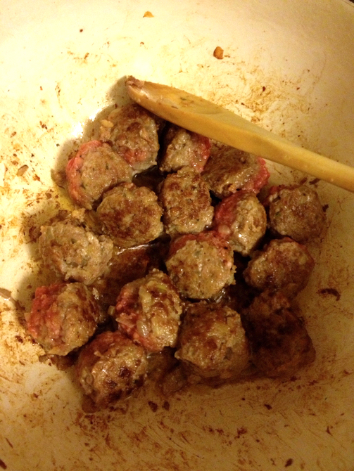
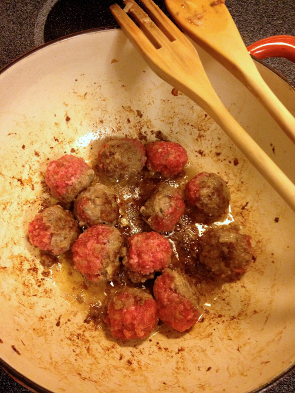

# Meatballs

This was once the family meatball recipe. It may have been through some telephone or dumbing down before it came to me. In addition, I removed some ground pork and Romano cheese, and added onion and an extra egg. I made it gluten-free once (when I was out of gluten) by substituting crushed generic rice chex for the bread crumbs.

## Ingredients

* 1 lb ground beef
* 1/2 cup bread crumbs
* 1/2 cup chopped onion
* 1 clove garlic, minced
* 1 tsp dried parsley
* 2 eggs, beaten
* 1 tsp salt
* 1/4 tsp pepper
* olive oil

## Directions

Brown the onion about 8 minutes in olive oil. Add the garlic for another minute. Remove onion and garlic from oil and put in a bowl with remaining ingredients. (Leave the pan on the heat.) Mix well. Roll into meatballs about 1 inch in diameter.

Brown on all sides in pan. 

Finish cooking meatballs either in oil or in sauce.
