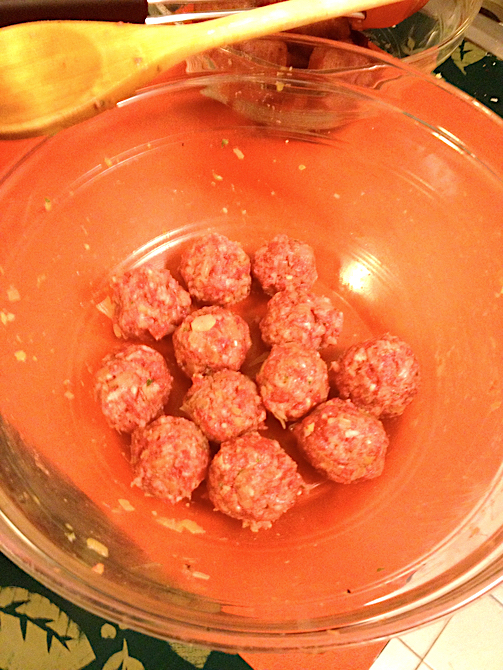

# More Meatballs

This is not the [family meatball recipe](../meat/meatballs.md); it's a meat variant of the turkeyballs I usually put in soup, also scaled up for a new size of ground beef from Costco.

## Ingredients

* 1 1/2 lb ground beef
* 3/4 c. panko
* 1/3 c. onion, minced or diced
* 4 cloves garlic, minced
* 1 1/4 tsp dried parsley
* 1 1/4 tsp dried basil
* dash oregano, marjoram, and/or thyme
* 2 eggs, beaten
* 1 1/4 tsp salt
* 1/2 tsp pepper
* 1 T. nutritional yeast (optional)
* olive oil

## Directions

1. Optionally brown the onion about 8 minutes in olive oil, and add the garlic for another minute, then remove from oil.  (Leave the pan on the heat.)
2. Mix all ingredients except oil.
3. Roll into meatballs about 1 inch in diameter.  
4. Brown on all sides in pan.  
5. Finish cooking meatballs either in oil or in sauce.
