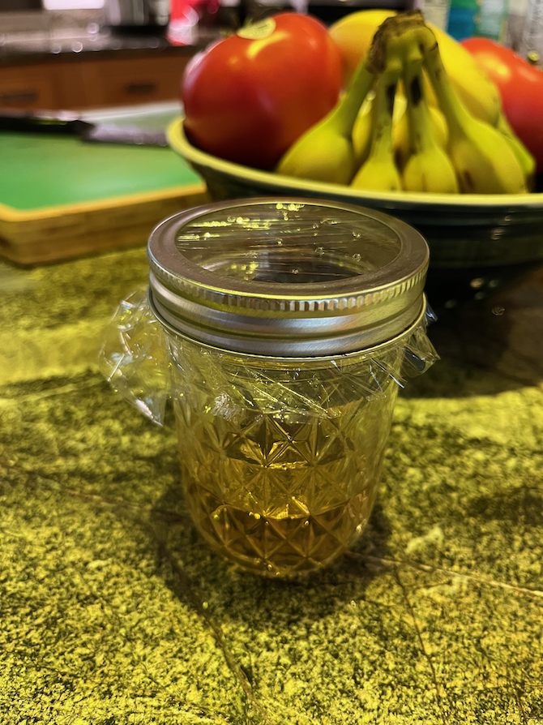

# Fruit Fly Trap

[The Kitchn](https://www.thekitchn.com/diy-fruit-fly-traps-22942130) attempted to rate a bunch of DIY fruit fly traps, but got the basic model wrong.
Here's how to do it right.

## Ingredients

* 1/4 c. apple cider vinegar
* 1 drop dishwashing liquid

### Equipment

* small container, *e.g.*, a small Mason jar
* saran wrap
* toothpick

## Directions

1. Pour ingredient into container.
2. Cover with saran wrap.
3. Poke **small** holes in saran wrap using toothpick.
4. Deploy.

## Variants

The Kitchn instead recommended poking small holes in a Mason jar cap using a nail, which is more permanent, but also more work.
