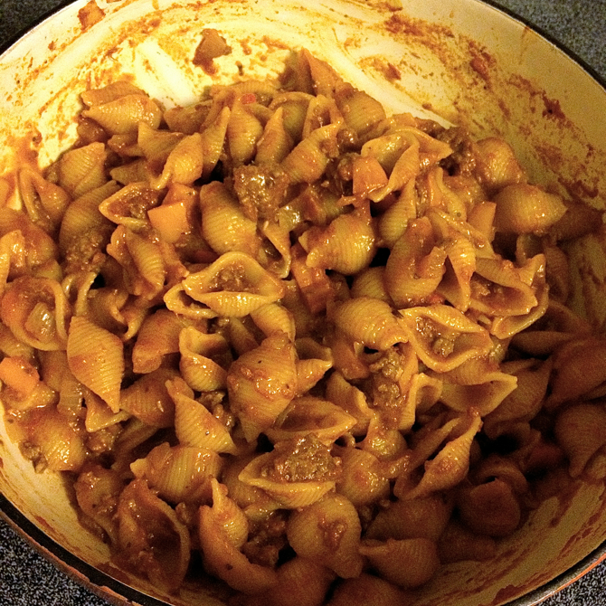

# Italian chop suey

This is another recipe put together out of much Google for Peter; I personally believe that ground beef should be concentrated into meatballs, not put loosey-goosey into the sauce.

## Ingredients

* 1 onion
* 1 bell pepper
* 6 cloves garlic
* 1 lb ground beef
* 1 28-ounce can whole tomatoes
* some tomato sauce or tomato paste
* 1/4 cup cooking wine
* 1 lb curly pasta
* salt
* pepper
* sugar
* 1/4 tsp. crushed red pepper
* 1/4 tsp. cinnamon
* 1 tsp cumin
* 1 tsp paprika
* oregano
* basil

## Directions

Sauté the onion, green pepper, and garlic in olive oil until soft. Add the beef and remaining spices and brown. Add the tomatoes and wine. Simmer to taste. Parboil the pasta and add to the meat. Simmer al dente.
