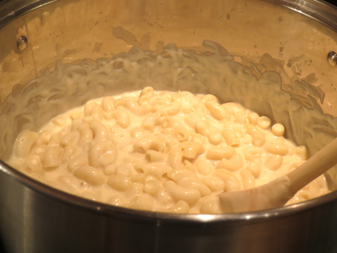
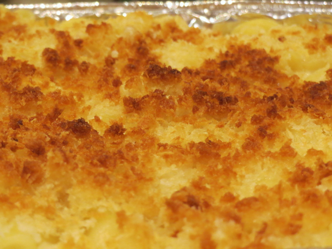

[photographed]: ../indices/photographed.html

# Mac and Cheese

The recipe was online briefly, but I assume it is gone already.

## Ingredients

* 8 oz. Monterey Jack, shredded (2 c.)
* 8 oz. cheddar, shredded (2 c.)
* 5 c. milk
* 8 T. unsalted butter
* 6 T. flour
* 1/2 T. (1 1/2 tsp.) mustard powder
* 1/4 tsp. cayenne pepper
* 1 tsp. salt
* 1 lb. macaroni, cooked with 1 T. salt past al dente but not al squishy
* 1 c. panko

## Directions

1. Cook pasta.
2. Work 3 T. of the butter into the panko with your fingers.
2. In the pasta pan or Dutch oven, on medium-high, heat 5 T. butter to foaming. 
3. Whisk in flour and spices. Whisk another minute. 
4. Whisk in milk slowly. Bring to full boil stirring constantly. 
5. Simmer on medium 5 minutes until the thickness of heavy cream. 
6. Remove from heat and add cheese and salt. 
7. Add pasta and return to medium-low heat for 6 minutes.  
8. Transfer to 9x13 baking dish, top with crumb mixture, and broil 3-5 minutes. 
9. Cool 5 minutes before serving. 

## Variants

The original recipe called for 5 slices bread pulsed with the butter in a food processor.  I have never made it that way.

Don't put the pan too close to the broiler if using panko as a substitute for fresh breadcrumbs.  Also, note that the original recipe said not to do that (but I almost always do it).

I tried doubling the cayenne pepper, to little effect.  I may need some new cayenne pepper...

You can substitute 8 oz. of Pepper Jack for the 8 oz. of Monterey Jack without making the mac'n'cheese obnoxiously spicy.

If you're low on panko, you can replace some with almond flour, or, preferably, almond meal.
