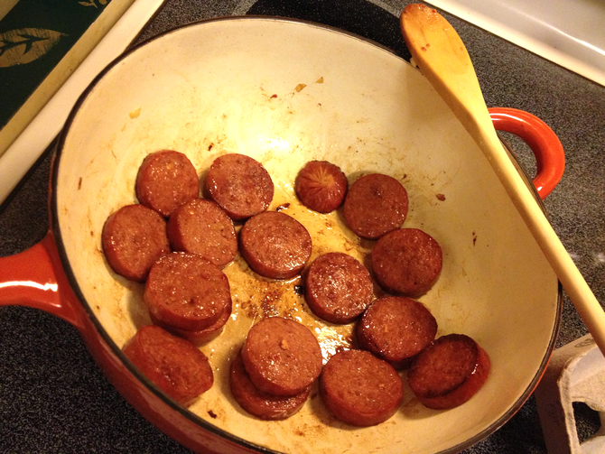
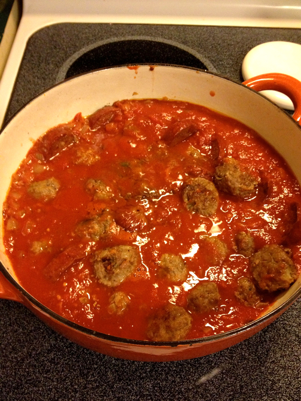

# Meat Sauce

This is the sauce that goes with [the meatballs](../meat/meatballs.md). More than a pound of meat can overwhelm the sauce, but it will still cook and be yummy.

## Ingredients

* olive oil
* 1 lb Italian sausage, meatballs, and/or chicken pieces
* 1/2 c. chopped onion
* 2 cloves garlic, crushed
* 1 large (2 lb 3 oz) can tomatoes
* 2/3 of a small (6 oz) can of tomato paste
* 1/2 tsp salt
* 1 tsp oregano or to taste

## Directions

1. Brown the meat in the oil (or continue in the pan from my meatball recipe). 
2. Remove the meat and brown the onions in the remaining fat. 
3. Add the garlic. 
4. Return the meat to the pan and add tomatoes. (If you drained whole tomatoes, make up for the liquid with 1/2 c. water.)
5. Mix in the tomato paste. 
6. Add seasonings. 
7. Simmer for at least one hour.
