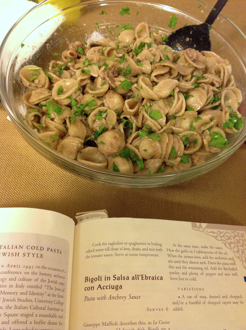

# Orecchiette with Anchovy Sauce

This recipe is derived from Bigoli in Salsa all'Ebraica con Acciuga from _The Book of Jewish Food_ by Claudia Rodin. I cut back on the anchovies (by half), but it's still a lot of anchovies for non-Italians. I usually forget or skip the pepper. I have never chopped the capers as instructed in the original recipe; maybe capers are bigger in Italy.

## Ingredients

* 1 lb orecchiette, preferably whole wheat
* 3 T. extra virgin olive oil
* 2-3 2 oz. cans anchovy fillets in oil
* 6 cloves garlic, crushed
* 1 bunch Italian (flat-leafed) parsley, chopped
* a handful of capers
* pepper to taste

## Directions

1. Boil pasta with a generous amount of salt and drain.
2. In a saucepan, heat garlic in oil just until the aroma rises.
3. Add anchovies with their oil and stir until they dissolve a bit.
4. Freshen pasta and mix with the sauce in a large bowl (or in the sauce pan, if it's large enough).
5. Add parsley, pepper, and capers.
6. Serve hot or cold.
