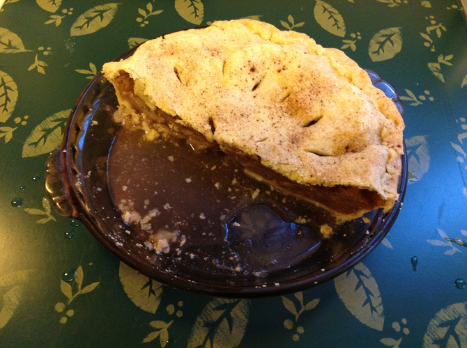

# Apple Pie

This started out as the Apple Pie recipe from the Better Homes and Gardens Cook Book (revised edition, 1951, ch. 15, p. 11). I reduced the water in the pastry dough, and Peter removed some filling ingredients he didn't approve of. Unfortunately, he didn't mention that the pie would need more time in the oven for the no-apple-gravy approach, so my first attempt came out a bit soggy. (Cooking times have been adjusted.)

## Ingredients

* 1 8" or 9" [double-crust pie shell](../pie/crust.md) (uncooked)
* 6 Cortland (and/or Granny Smith and/or Braeburn) apples
* 3/4 c. sugar 
* 2 tsp. Vietnamese cinnamon 
* 1/4 tsp. nutmeg

## Directions

1. Slice apples thin.
2. Toss with remaining ingredients.
3. Preheat oven to 450° F.
4. Fill bottom pie crust with apples, top, and seal.
5. Cut vents into top crust.  Optionally, sprinkle with cinnamon.
6. Bake 10 minutes at 450°.
7. Reduce heat to 350° and bake 45-50 more minutes.
8. Cool.
