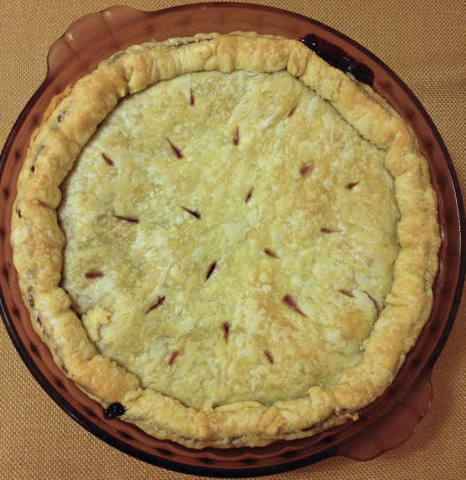

# Blueberry Pie

This is a mix of the Better Homes and Gardens Blueberry Pie recipe and the Joy of Cooking Berry or Cherry Pie with Frozen Fruit recipe.  I found the optional spices [online](http://localfoods.about.com/od/piestarts/r/spicedblueberrypie.htm) and snuck them into my latest pie.

## Ingredients

* 1 9" double-crust pie shell (uncooked)
* 20 oz. frozen blueberries
* 1 scant c. sugar
* 1/4 c. flour
* 1/8 tsp. salt
* 1 T. lemon juice
* 2 T. butter or butter flavored Crisco
* 1/8 tsp. cinnamon (optional)
* 1/4 tsp. nutmeg (optional)
* 1/8 tsp. black pepper (optional)

## Directions

1. Defrost blueberries.
2. Make and chill dough for crust. 
3. Mix non-crust ingredients.
4. Preheat oven to 450 F.
5. Roll out and fill crust.
6. Bake 10 minutes at 450, then bake 35-40 more minutes at 350.
7. Cool.
