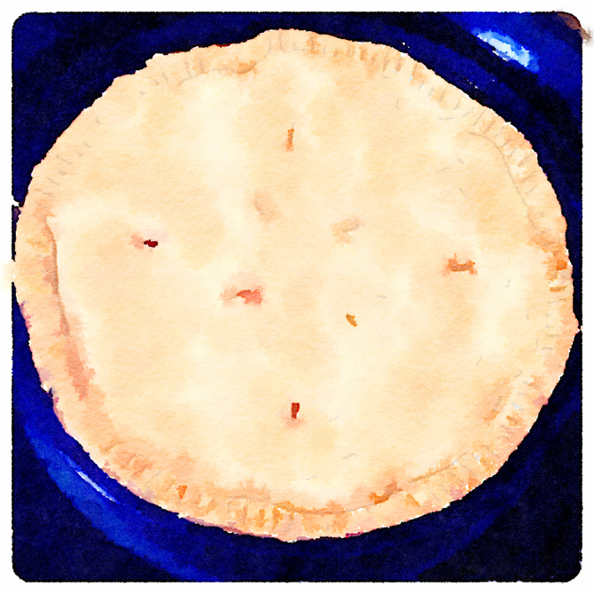
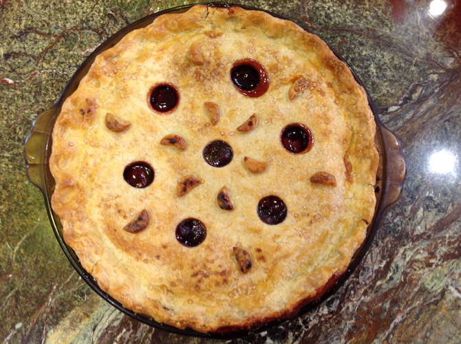

# Crust

First, the crust.  My crusts all started from the basic piecrust recipe in my old Better Homes and Gardens Cookbook (which my sister said to use), but have been adjusted so I don't have to keep doing the math.  They use shortening; for a butter crust, see my [pumpkin pie recipe](../pie/pumpkin.md).

## Ingredients 

### Single-crust pie shell

(This is half of the 10" double-crust pie recipe.)

* 1 c. flour 
* 1/2 tsp salt 
* 1/3 c. butter-flavored Crisco (or other shortening) 
* 2 1/2 - 3 T. cold water

### Double-crust pie shell (8")

* 1 1/2 c. flour 
* 1/2 tsp. salt 
* 1/2 c. butter-flavored Crisco (non-dairy) 
* 3 to 4 T. cold water

### Double-crust pie shell (9")

(This should do for a 9" pie.)

* 1 3/4 c. flour 
* 1/2 c. + 1 T. + 1 tsp. butter flavored Crisco (non-dairy) 
* 1/2 tsp. salt 
* 4-5 T. cold water

### Double-crust pie shell (10")

* 2 c. flour 
* 3/4 tsp salt 
* 2/3 c. butter-flavored Crisco (or other shortening) 
* 5-6 T. cold water

## Directions (All Crusts)

1. Mix flour & salt.
2. Cut in shortening with a pastry cutter until pieces are pea-sized.  
3. Add water gradually (a teaspoon at a time) until just damp.  (You won't need all the water.)
4. Squeeze into a ball.
5. For a double crust, divide in half and use the larger half (if one is larger) for the bottom crust.
6. Chill in plastic wrap for about an hour. 
7. Roll the bottom crust out between sheets of wax or parchment paper, or between a silicone pie mat and the plastic wrap.  It should come out to at least 1" bigger than the pie plate all around, possibly more if you intend to fold some over the top crust or top with a lattice.  
8. Peel off the silicone or thicker layer of paper.
9. Use the other layer to flip the crust into pie plate.  Adjust carefully if it's off-center, then peel off the paper/wrap.
10. Fill with desired filling.
11. If there's a top crust, chill the bottom for now.  Otherwise, [crimp the edge](https://www.thespruceeats.com/how-to-crimp-pie-crust-4123830) with your fingers and you're done!
11. For a top crust, roll out the remaining dough the same way. 
12. Optionally, prep the seam by rubbing shortening on the top edge of the bottom crust.
13. Peel off the thicker layer.  If making decorative holes instead of slit vents, punch them out now.  
14. Center the top over the pie, then peel the other sheet off carefully.
15. Optionally, if there's enough slack, fold the top crust under the bottom crust at the edge, or the bottom over the top.
16. [Crimp the edge](https://www.thespruceeats.com/how-to-crimp-pie-crust-4123830) of the crust with your fingers or press with a fork to seal.  (I usually do the fork thing.)
17. Optionally, brush top crust with milk, cream, or egg yolk, or use egg white and sprinkle with sanding sugar.
18. Cut vents into top crust with a small knife (if solid) and bake as directed.

## Variants

For a lattice top, have a look at [this pictorial how-to](https://www.simplyrecipes.com/recipes/how_to_make_a_lattice_top_for_a_pie_crust/).  Note that you need to roll out the bottom crust big enough to fold over the lattice edges.
