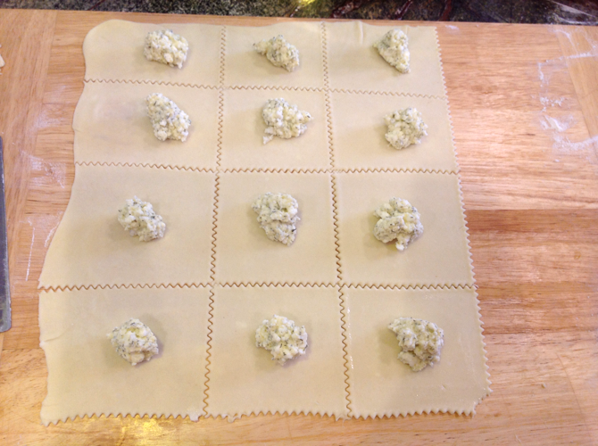
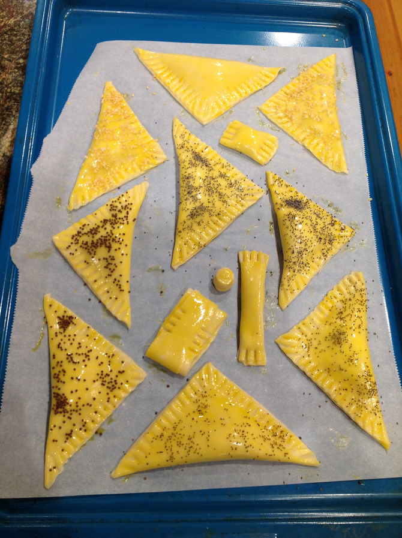
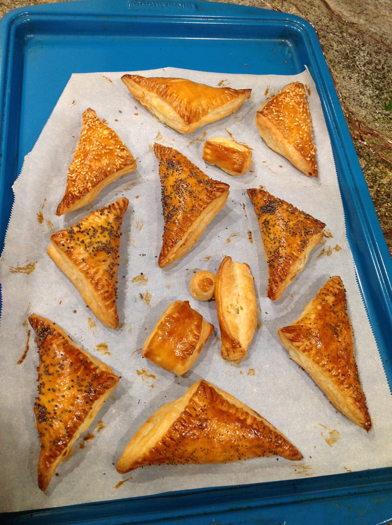

# Savory Feta Puff Pastry

I wrote up my [Rough Puff](../pie/roughPuff.md) recipe in order to make this Romanian treat from [The Bossy Kitchen](https://www.thebossykitchen.com/feta-black-caraway-pastries/) for a party that didn't end up happening (so we just ate the first batch for brunch and froze the rest).  Like many recipes, this one called for store-bought puff pastry (made of shortening), but it's very easy to rough it and have real buttery pastry.  The original also makes 5" squares, while I was going for something snackier at 4".

The original recipe called for "black caraway".  Since it's unlikely you have either spice this could mean at hand, it probably doesn't matter which one was intended.  But for the record, "black caraway" seeds may come from either *Nigella sativa* (nigella) or *Bunium bulbocastanum* (great pignut).  Pignut seed isn't known to be used as a spice in Europe, so the intended topping is probably nigella, also known as black caraway, black cumin, black onion, black seed, fennel flower, nutmeg flower, Roman coriander, and *kalonji*.  You can find some of that, substitute poppy or sesame for it, or leave it off entirely.

Makes about 24 4" triangles.

## Ingredients 

* 1 lb. rough puff pastry dough (or 1 box puff pastry sheets)
* 1/2 lb. feta
* 1 egg
* 4 T chopped fresh dill (optional)
* 2 T nigella (optional)
* 1 egg for an egg wash (optional)

## Directions

1. Defrost puff pastry according to package/recipe directions if using frozen.
2. Crumble feta with a pastry cutter or fork.
3. Mix in 1 egg and optional dill and set aside.
4. Optionally, divide dough in half.   (If you have more space, feel free to roll it all out at once.)
5. Roll out thin on a lightly floured board into a rectangle about 12" x 16".  (You probably don't need to do anything but the math on store-bought sheets.)
6. Preheat oven to 400°F.
6. Slice into 4" squares with a dough scraper or other appropriate implement.
7. Plop a scant tablespoon or heaping teaspoon of cheese in the center of each square.
8. Fold over.  If your squares aren't perfect, the dough is stretchy enough to adjust at this point.
9. Wet the edges and crimp with a fork.
10. Place on a parchment-paper covered cookie sheet.
10. Brush with egg (especially if you're sprinkling stuff on top) or water.
11. Sprinkle with nigella or other topping.
12. Bake 15--20 minutes.
13. Repeat for any remaining dough.

## Variants

Using just feta makes these pretty salty, but Peter liked them that way.  For milder cheese options, try [Tori Avery's cheese bourekas](https://toriavey.com/toris-kitchen/cheese-bourekas/) recipe, which includes ricotta and kashkaval (for which you can substitute gruyere or cheddar).

If the filling sounds more appealing than the puff pastry, you can apparently mix it up into a solid dough pastry as in [this recipe from Yasemin's Kitchen](http://yaseminskitchen.com/savory-dill-and-cheese-pastry/).

You can try it with [blitz puff pastry](../pie/blitzPuff.md) instead of rough puff.

Other nigella substitutions (besides sesame and poppy) that I've seen suggested include celery seed, cumin seed, black mustard seed, brown mustard seed, black (unhulled) sesame, caraway/fennel/anise seed, and coriander seed.  Actual onion seeds are sometimes suggested but they are neither easier to find nor a useful spice.  Oregano is an interesting suggestion, but in this case better substituted for the dill than the nigella.

