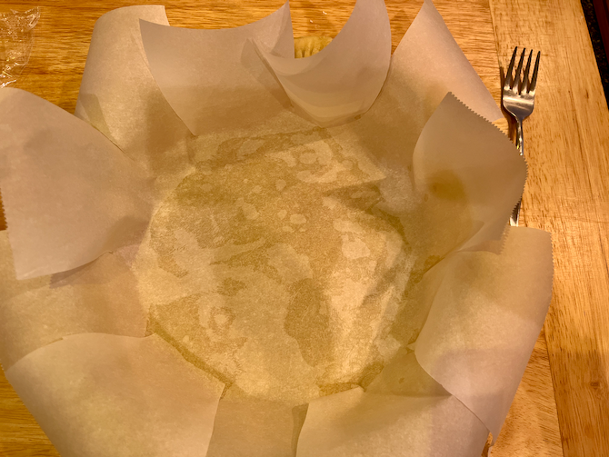
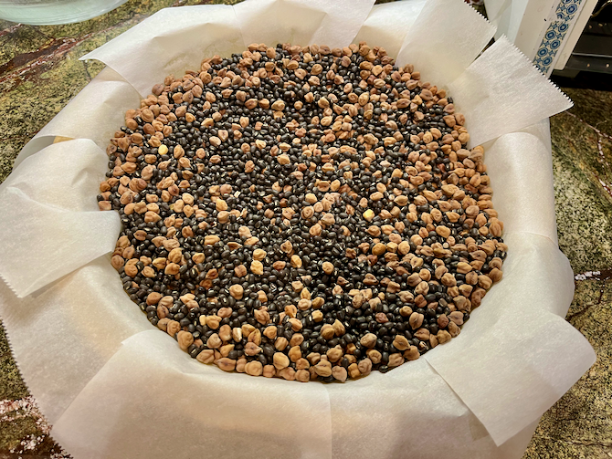
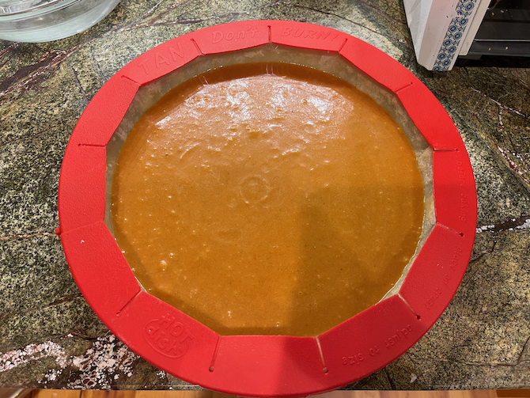
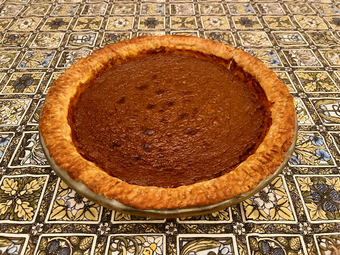

[thanksgiving]: ../indices/thanksgiving.html
[photographed]: ../indices/photographed.html

# Non-Dairy Pumpkin Pie

I make a lot of fruit pies from scratch, but there is much to be said for the "open some cans" simplicity of pumpkin pie.  This adaptation of [Pareve Pumpkin Pie](https://jamiegeller.com/recipes/parve-pumpkin-pie/) features a can of coconut milk, though it doesn't taste too terribly coconutty afterwards.  Some ingredients have been added from my dairy [pumpkin pie recipe](../pie/pumpkin.md).

I usually make shortening crusts, so I just used a [single crust](../pie/crust.md).  (The original recipe did not specify a pie size, but neither does my single crust.  My batch fit comfortably into a deepish 9" pie pan.)  You can also use a store-bought pie crust.

You can mix the filling ahead of time and refrigerate, if that helps.  Pie crust is also time-consuming because of the chilling and blind baking.

Makes: 1 pie.

## Ingredients

* one [single-crust pie shell](../pie/crust.md)
* 1 lb. (or 15 oz.) can pumpkin (solid pack, 100%, pure, etc.)
* 1 c. brown sugar
* 1 egg
* 2 T. melted shortening
* 1 T. flour
* 1 tsp. ginger
* 1 tsp. cinnamon
* 1/2 tsp. nutmeg
* 1/2 tsp. salt
* 1/2 tsp. vanilla (optional)
* dash pepper (optional)
* dash clove
* dash allspice
* 1 1/2 c. (most of one 14 oz. can) coconut milk

## Directions

1. Make or unwrap crust.
2. Mix the filling ingredients, optionally using an immersion or other blender to smooth the pumpkin or other clumpy ingredients more.
3. Optionally, blind bake a homemade crust at 400° for 5 minutes, *filled* with pie weights and/or dried beans.  You may want to protect the edge.  You may want to bake it another 5 minutes after removing the weights.    
4. Preheat oven to 375°.
5. Fill crust.  
6. Bake 1 hour.  Again, it's advisable to protect the edge.  
7. Cool.

## Variants

The original recipe included 1/2 tsp. pepper, which has been reduced to a more reasonable quantity.  My other recipe uses more cinnamon.

Replace spices with 1 T. [pumpkin spice](../appetizers/pumpkinSpice.md).

You can puree your own pound of (cooked) sugar pumpkin or butternut squash.
