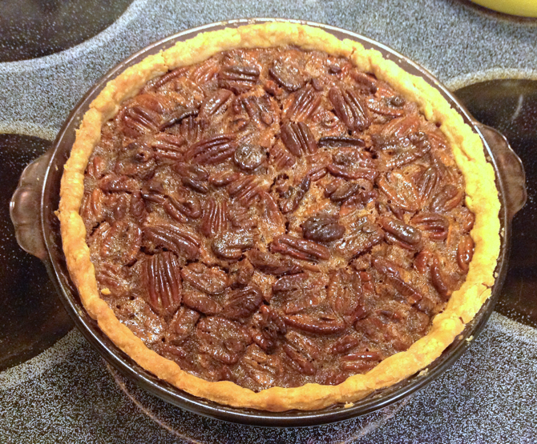

# Pecan Pie

Peter likes lots of pecans in his pie, so I found a simple recipe with more pecans than most.  This one is from [Martha Stewart](http://www.marthastewart.com/312503/pecan-pie).

## Ingredients

* 1 9" single-crust pie shell (uncooked)
* 4 large eggs 
* 1 c. light corn syrup 
* 1/3 c. packed light-brown sugar 
* 1/4 c. granulated sugar 
* 4 T unsalted butter, melted 
* 1 tsp vanilla extract 
* 1/2 tsp salt 
* 3 c. pecan halves 
* lightly sweetened whipped cream, for serving (optional)

## Directions

1. Preheat oven to 375°. with rack set in lowest position. 
2. Using kitchen shears or a paring knife, trim dough to a 1-inch overhang. With floured fingers, fold overhang under itself to form a rim; pinch between thumb and forefinger to form a uniform edge around rim of pie plate. Crimp with fingertips. Transfer dough-lined pie plate to refrigerator. 
3. Make filling: In a large bowl, whisk eggs, corn syrup, sugars, butter, vanilla, and salt until smooth; mix in pecans. Pour mixture into chilled pie crust; place pie plate on a rimmed baking sheet. Bake until filling jiggles slightly in the center when gently shaken, 50 to 60 minutes. 
4. Cool pie completely in plate, 5 to 6 hours. Serve with whipped cream, if desired.

