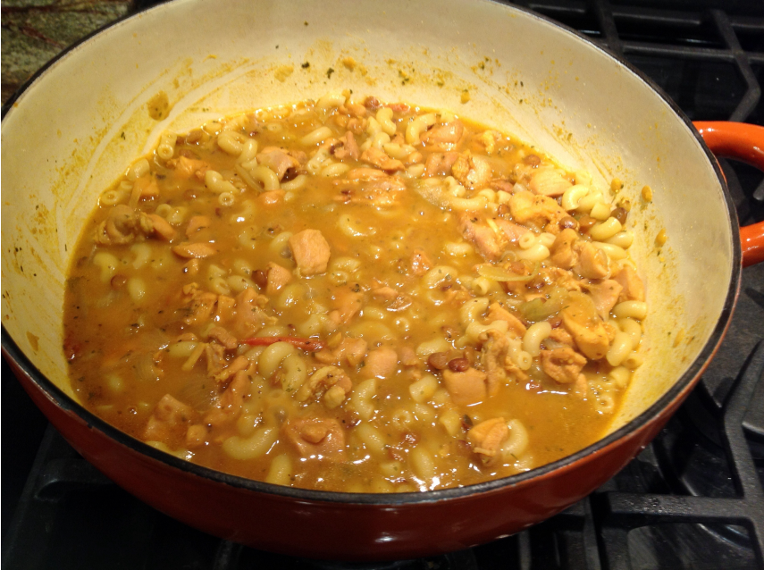

# Treda

I cut this down from Cooking at the Kasbah because my package of chicken quarters was only 1 1/2 lbs., instead of the recommended 2 1/2 lbs. of thighs.  I also figured out various substitutions as noted in the recipe, though later I found a huge bag of fenugreek seed, so I'm set for life.  Sometimes I make the whole 2 1/2 lbs. chicken, but my style, and/or use an Instant Pot, so those instructions are also included.

The translated title in Cooking at the Kasbah was "Tagine of Chicken and Lentils with Fenugreek."

Note that fenugreek is an acquired taste.

Serves 2--3, depending on how much chicken they want.

## Ingredients (1 1/2 lbs.)

* 1 1/2 lbs. chicken quarters, separated, or thighs
* 1 T olive oil
* 1 onion, sliced
* 1 medium or 3 small campari tomatoes (or 1 oz. tomato paste)
* 1 tsp. pepper
* 1 tsp. turmeric
* 1 tsp. salt
* 2--3 1/2 c. water or broth, depending on how soupy you want it (1 c. in an Instant Pot)
* 2 cubes frozen cilantro (or 20 sprigs fresh, fished out at the end)
* dash dried coriander (or 1 tsp, if no frozen or fresh cilantro)
* dash ground coriander (or 1 tsp, if no frozen or fresh cilantro)
* 2 T fenugreek seeds (or 2 tsp powdered)
* 1 tsp. Ras el Hanout (optional)
* 1/4 c. brown lentils (preferably small ones)
* 1/8 c. red lentils
* 1/2 lb short pasta, cooked, or a few slices of crusty bread

## Ingredients (2 1/2 lbs.)

* 2 1/2 lbs. chicken thighs
* 2 T olive oil
* 2 onions, sliced
* a third of a can (2 oz.) tomato paste 
* 2 tsp. pepper
* 1 tsp. turmeric
* 1 1/2 tsp. salt
* 4--5 c. water or broth, depending on how soupy you want it (2 c. in an Instant Pot)
* 4 cubes frozen cilantro
* 1/4 c. fenugreek seeds (or 4 tsp powdered)
* 2 tsp. Ras el Hanout (optional)
* 1/2 c. brown lentils (preferably small ones)
* 1/4 c. red lentils
* 1/2 -- 1 lb short pasta, cooked, depending on how far you want to stretch the recipe

## Directions

For Instant Pot or stovetop.

1. Brown onions in oil.
2. Add tomatoes, first three spices, and chicken. Saute 5 minutes.
3. Add water, remaining spices, and lentils.  Cover and cook on medium 40 minutes on stovetop, or pressure cook on high for 20 minutes.  (Release pressure either way.)
4. Serve over pasta or crusty bread.

## Variants

The Instant Pot, chicken broth, chicken quarters, powdered fenugreek, the early addition of lentils, and anything but fresh sprigs of coriander are variants (quantities noted above).  In the traditional recipe, lentils are added after the first 40 minutes, and cooked for another half an hour.

I served this with macaroni (in addition to the bread) the first time, and Peter liked it that way, so I usually use some shell-like pasta instead of stale bread.

I once substituted 1 lb boneless thighs for the 1 1/2 lbs bone-in thighs.

More spice/herb options are discussed at [Taste of Maroc](https://tasteofmaroc.com/moroccan-chicken-rfissa/), most notably Ras el Hanout.

You may want to increase the liquid by 1/2--1 cup if your Instant Pot tends to emit burn notices.

