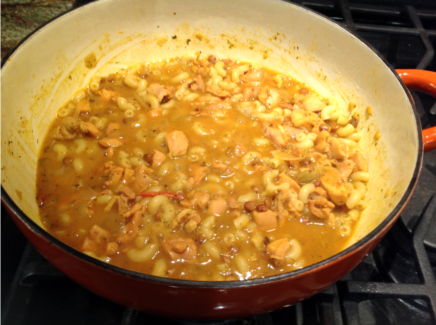

# Treda

I cut this down from Cooking at the Kasbah because my package of chicken quarters was only 1 1/2 lbs., instead of the recommended 2 1/2 lbs. of thighs. I also figured out various substitutions as noted in the recipe, though later I found a huge bag of fenugreek seed, so I'm set for life.  

The translated title in Cooking at the Kasbah was "Tagine of Chicken and Lentils with Fenugreek."

Note that fenugreek is an acquired taste.

Serves 2--3, depending on how much chicken they want.

## Ingredients

* 1 T olive oil
* 1 onion, sliced
* 1 medium or 3 small campari tomatoes
* 1 1/2 lbs. chicken quarters, separated, or thighs
* 1 tsp. pepper
* 1 tsp. turmeric
* 1 tsp. salt
* 2--3 1/2 c. water or broth, depending on how soupy you want it
* 2 cubes frozen cilantro (or 20 sprigs fresh, fished out at the end)
* dash dried coriander (or 1 tsp, if no frozen or fresh cilantro)
* dash ground coriander (or 1 tsp, if no frozen or fresh cilantro)
* 2 T fenugreek seeds (or 2 tsp powdered)
* 1/4 C brown lentils (preferably small ones)
* 1/8 C red lentils
* a few slices of crusty bread

## Directions

1. Brown onions in oil.
2. Add tomatoes, first three spices, and chicken. Cook 5 minutes.
3. Add water, remaining spices, and, optionally, lentils.  Cover and cook on medium 40 minutes.
4. Optionally, add lentils now and cook up to 30 more minutes, depending on your patience and the age of your lentils.  (Or skip ahead to step 5.)
5. Serve over crusty bread.

## Variants

Chicken broth, chicken quarters, powdered fenugreek, the early addition of lentils, and anything but fresh sprigs of coriander are variants (quantities noted above).

I served this with macaroni (in addition to the bread) the first time, and Peter liked it that way.

I once substituted 1 lb boneless thighs for the 1 1/2 lbs bone-in chicken.

