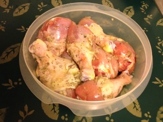
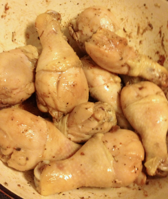

[passover]: ../indices/passover.html
[photographed]: ../indices/photographed.html

# Turkey Chicken

"Turkey Chicken" a.k.a. "Fake Turkey" is a turkey drumstick recipe that I make with chicken drumsticks instead. The original recipe was "Pot-Roasted Turkey Drumsticks" from _The Italian Jewish Kitchen_ by Edda Servi Machlin. Other alterations to the recipe involve drastic shortening of the marinating period, significantly less oil, and boiling during the simmering step. I usually cut the recipe in half or freeze half before cooking.

Usually I serve it with pasta, but once, I served it with spaghetti squash.

## Ingredients

* 3 1/2 - 4 lbs chicken legs
* 1 T salt
* 1 tsp dried rosemary
* 1 tsp dried sage
* 1 tsp dried marjoram
* dash nutmeg
* 1-3 cloves garlic, minced or crushed (into the oil)
* 1/3 c. olive oil
* 1/2 c. white cooking wine

## Directions

1. Pat legs dry and roll in a mixture of the salt, spices and minced garlic.
2. Pour on about a third of a cup of olive oil.
3. Marinate until you're hungry or out of time.
4. Brown legs.
5. Cook at medium heat, stirring frequently, for 20 more minutes.
6. Add wine. Reduce until you're really hungry, then serve.

I do the mixing and marinating in a big tupperware container:

## Variants

Substitute 1 T fresh spice for any of the 1 tsp dried spices.

For a lot more turkey chicken at a time, you can bake it; see [Turkey Chicken for a Crowd](../poultry/bakedTurkeyChicken.md).

I have made this with actual turkey drumsticks, but I ended up roasting them because (apparently) they don't come in small outside of Italy.  It took about an hour at 350° with convection.
