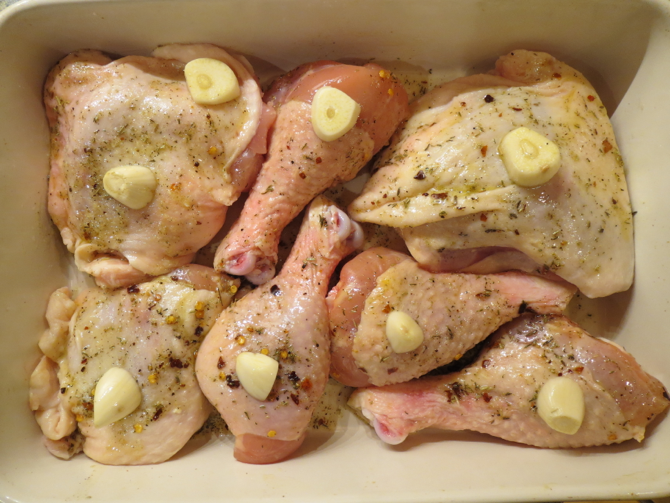
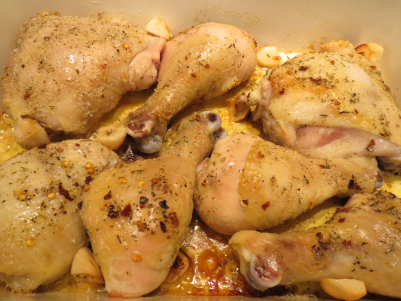
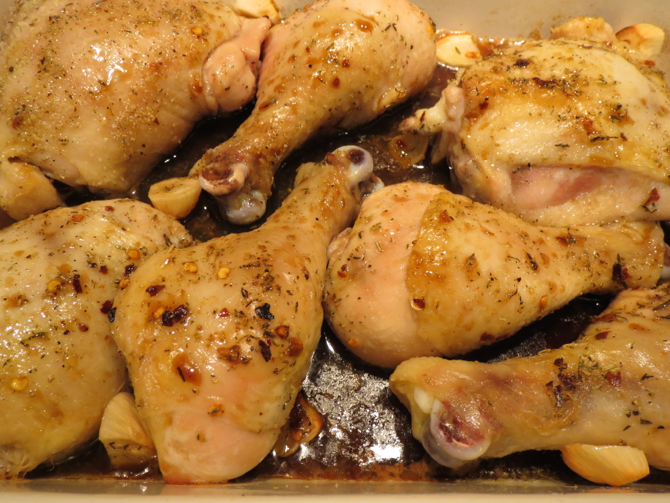
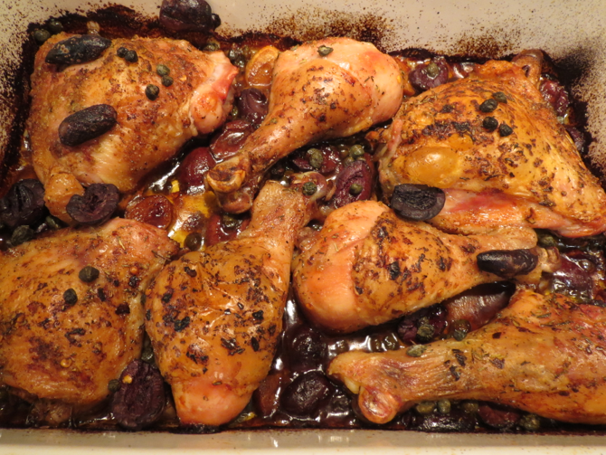

# Tuscan Chicken with Olives and Capers

This is a combination of [two](http://leitesculinaria.com/81989/recipes-roast-chicken-pancetta-olives.html) [recipes](http://hungrydomaine.com/index.php/2014/06/18/no-time-to-cook-roasted-chicken-with-black-olives-capers-and-rosemary/) I found online in a search for chicken with black olives and possibly capers.  They went through the usual process of adjustment:  fewer squirrels (rabbits, in this case), less forethought/marinating, and more spices.

Total cooking and resting time is 50 minutes to an hour.

## Ingredients

* 2 lbs. chicken legs and or thighs
* 2 T olive oil
* 1/2 tsp dried thyme
* 1 tsp fresh rosemary
* 1/4 tsp red pepper flakes (heaping)
* 1/4 tsp black pepper
* 1/2 tsp sea salt
* 3 cloves garlic, whole
* 1/3 c. white wine
* 2 T balsamic vinegar
* 1-2 T capers
* 12 Kalamata olives, optionally pitted and quartered

## Directions

1. Preheat oven to 450°.
2. Rub the chicken with a mix of the salt, spices, and oil (or sprinkle the oil on separately).
3. Put chicken and garlic in a baking dish or deep baking sheet, skin-side up if it has sides.
   
4. Roast 20 minutes.    
   
5. Sprinkle with wine and vinegar and roast 8 more minutes.
   
6. Scatter olives and capers in dish and roast 15-20 more minutes until sufficiently crispy looking.
   
7. Let rest 10 minutes before serving.

## Variants

I once tried the recipe with boneless chicken thighs, cutting it down to one step: put everything in the baking dish at once and bake slightly cooler for much less time.

I once tried it with chopped delicata squash, added in with the wine and vinegar (since that seemed to be the appropriate amount of cooking time).

You can toss all the ingredients plus two-thirds of a cup of water into an Instant Pot and pressure cook on high for about 20 minutes plus a natural release, depending on the size and frozenness of your chicken.  You'll need to reduce the water afterwards if you want a sauce, or save it for risotto.
