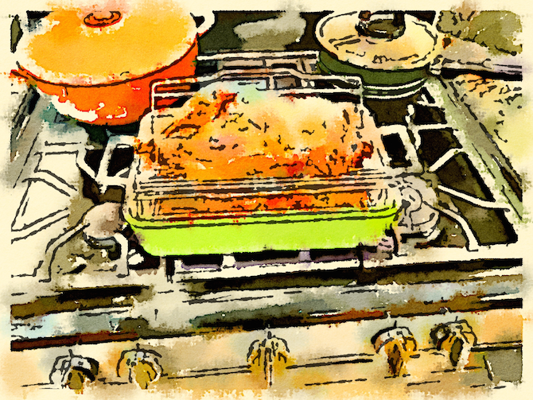

# About The New Kitchen Cookbook

My recipes were living in [Springpad](https://en.wikipedia.org/wiki/Springpad) (and on paper) when I discovered [Penflip](http://web.archive.org/web/20200510044910/https://www.penflip.com/).  I thought they needed a bit more organization than SpringPad was giving them (and I wanted my recipe descriptions back that SpringPad had dropped for no reason), so I decided to turn them into a real Penflip book.

Penflip was a pretty but buggy front-end to Git and Pandoc whose inconveniences began to outweigh its benefits for me, especially once I integrated the recipes into my website.  So I moved the cookbook again, to [GitHub](https://github.com/mcdemarco/the-new-kitchen-cookbook/), where you can dig up the latest recipes and corrections if you are sufficiently technically inclined.

## Region

If I had to describe the cookbook, I'd call it Mediterranean-American.  Most of the soups are Portuguese; most of the cookies are Italian.  (It's not a cookie without anise.)  The Pasta chapter is mostly Italian as well, but there are also a few North African recipes, some American standards, and plenty of basics so I don't have to look them up elsewhere every time.  The bread is mostly no-knead.
