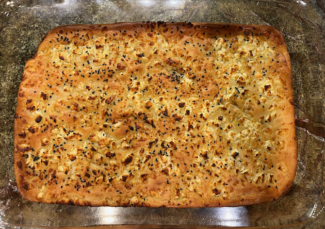

[KitchenAid]: ../indices/kitchenAid.html
[quick]: ../indices/quick.html

# Alevropita (Quick Feta Flatbread)

This chewy flatbread is a cut-down version of a traditional Greek "pie".  I made the full version from [Marilena's kitchen](https://marilenaskitchen.com/feta-cheese-flat-bread/) in a glass baking dish: 

I thought it could use some baking powder and might crisp up better in a metal pie tin, so I applied some math and [other](https://www.kalofagas.ca/2024/03/17/alevropita/) [recipes](https://30daysofgreekfood.com/mediterranean-greek-flour-pie/) to devise my smaller version.

Serves 3--4.

## Ingredients

### Dough

* 3/4 c. flour
* 1/2 c. milk
* 1 egg
* 1/4 c. plain yogurt
* 1/4 tsp. baking powder
* 1/4 tsp. salt
* dash pepper

### Topping

* oregano to taste
* 1/2 c. crumbled feta 
* 1 T olive oil, plus more for the pan

## Directions

1. Preheat the oven to 400° F.
2. Oil a pie tin and place it in the oven to warm.
3. Mix the dough ingredients, optionally in a stand mixer.  (A paddle is fine for this recipe.) 
4. Prep the toppings if necessary.
5. Take out the pie tin and brush to distribute the oil.
6. Pour in the dough.
7. Top with the toppings.
8. Bake 20--25 minutes or until golden on top, poking any bubbles that develop.

Serve warm.

## Variants
For a muffin-shaped version, see my [Eliopsomo](../bread/eliopsomo.md).

I like to chop some olives and add them to the dough.  I also add some oregano and sometimes allspice to the dough.
