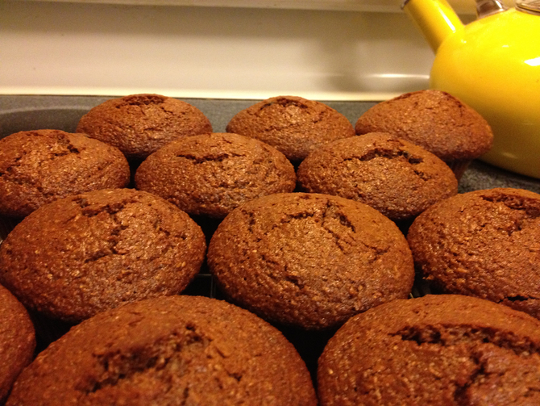

# Bran Muffins for Mom

This is a slight alteration of "Raisin Bran Muffins That Work," Recipezaar recipe #73061, that my mother likes. I made it non-dairy. I've only made the blueberry version once or twice.  I also made a diced pear version once.

## Ingredients

* 2 eggs
* 1 c. soy milk
* 1/2 c. canola oil
* 1/4 c. molasses
* 3/4 c. brown sugar
* 1/2 tsp. vanilla extract
* 1 1/2 c. wheat bran
* 1 1/2 c. flour
* 3/4 tsp. salt
* 2 tsp. baking powder
* 1/2 tsp. baking soda
* 1 c. raisins (or blueberries, diced pear, etc.)

## Directions

Preheat oven to 400° F. Beat wet ingredients and sugar. Add bran and let sit 5 minutes. Dust raisins with rye or white flour. Mix other dry ingredients in separate bowl. Add flour mixture to bran mixture and stir gently. Add raisins. Fill 12 muffin cups. Bake 20 minutes.
